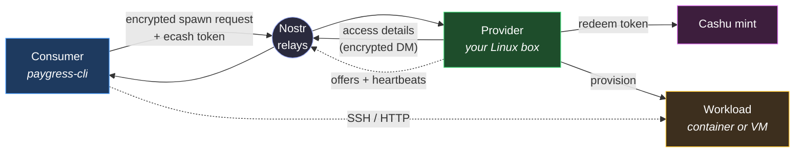
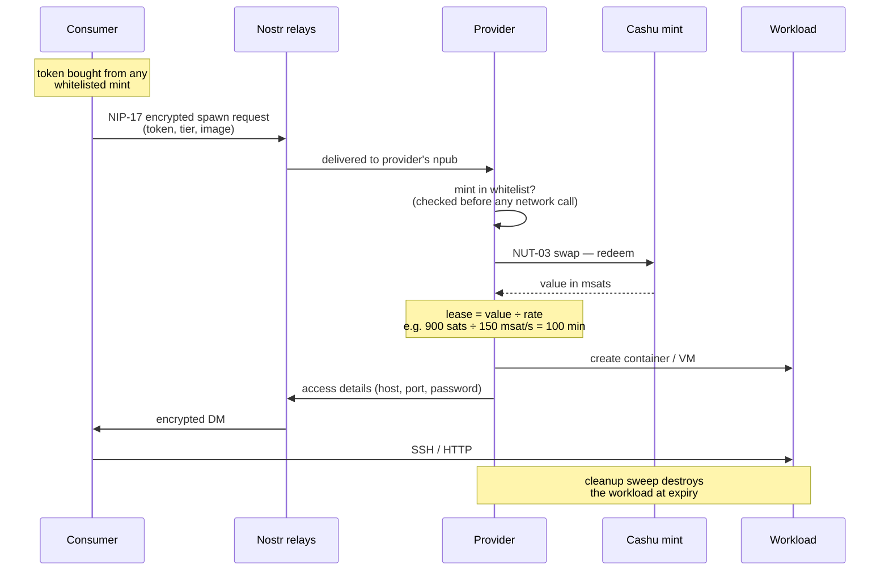
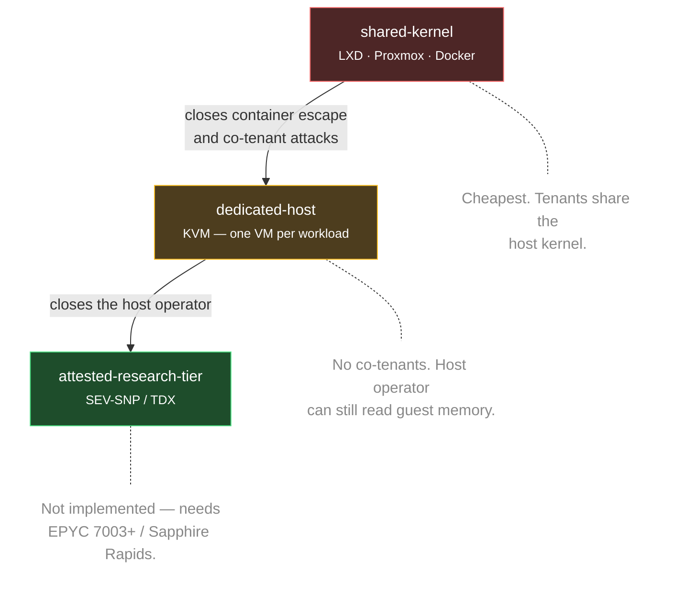
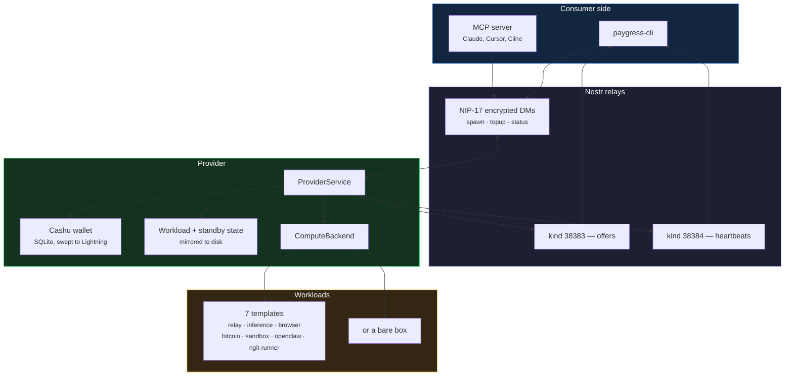

# [Paygress](https://paygress.net)

**Pay-per-use compute with Lightning + Nostr. No accounts, no signups.**

https://github.com/user-attachments/assets/627d2bb1-1a9b-4e66-bc42-7c91a1804fe1

Paygress is a marketplace where anyone can buy or sell compute resources using Cashu ecash tokens. Providers advertise on Nostr, consumers discover and pay - all anonymous, all instant.



**No account exists anywhere in that picture.** The token is a bearer credential, the identity is a throwaway Nostr key, and the lease ends when the money runs out.

## What you can do

In plain English, what Paygress lets a user do today:

- **Rent a Linux container by the second.** Hand it a prepaid voucher, get a container running on someone else's machine. No signup, no credit card, no email. The container shuts down when the voucher runs out; extend the lease anytime by handing over another voucher.
- **Pick from seven ready-made boxes.** Generic Python + Node sandbox (with a built-in HTTP exec endpoint — run code without SSH); AI inference endpoint (Ollama, OpenAI-compatible API); Nostr relay; disposable headless Chrome; Bitcoin node; OpenClaw; and a one-shot ngit CI runner.
- **Run code inside the sandbox without SSH.** The agent-sandbox template ships with a bundled HTTP exec server. POST a command, get back stdout/stderr/exit code. Same credentials as SSH, no extra setup.
- **Run many containers in parallel.** One command spawns N containers, splits a single voucher N ways automatically, hands you a JSON manifest with each one's address. Built for batch jobs (render farms, ML batch inference), CI matrices (one runner per OS/version), and map-reduce workloads.
- **Long-running services with automatic failover.** Pay 3 hosts at once (one primary, two standbys). The primary runs the actual container and pings the network every minute. If it stops pinging — machine crashed, network died — the first standby takes over within ~30 seconds, becomes the new primary. (V1 caveat: best-effort single-writer for ~30s during failover; ideal for relays / stateless services, see PR #43 for the full story.)
- **Let AI assistants do all this for you.** A built-in MCP server plugs into Claude Desktop, Cursor, Cline, Claude Code with one config block. The assistant gets six tools: discover providers, spawn a sandbox, fan out N spawns, monitor a lease, extend a lease, and run code inside the sandbox. So Claude can say *"let me run that for you"* and within seconds has actually executed your code in a sandbox it paid for itself.
- **Become a host yourself.** Run the provider command on a Linux box you own and start renting compute to anyone with vouchers. Heartbeats publish your availability; consumers find you through discovery. You earn vouchers per second of compute served.

## Prerequisites

Install Rust via [rustup](https://rustup.rs/):

```bash
curl --proto '=https' --tlsv1.2 -sSf https://sh.rustup.rs | sh
```

Install required system libraries (Ubuntu/Debian):

```bash
sudo apt update && sudo apt install -y pkg-config libssl-dev
```

---

## Install

```bash
cargo install paygress-cli
```

---

## For Consumers

### 1. Find a provider

```bash
# Browse all providers on Nostr
paygress-cli list

# Filter and sort
paygress-cli list --online-only --sort price

# Get details on a specific provider
paygress-cli list info <PROVIDER>
```

Each provider has a **3-word auto-generated name** (e.g. `SwiftGoldenOwl`) derived
from its Nostr key, shown in the `list` table.  All `--provider` flags accept either
the friendly name **or** the raw provider ID (full hex, `npub1…` bech32, or an
unambiguous 8+ character prefix):

```bash
# These are equivalent:
paygress-cli spawn --provider SwiftGoldenOwl ...
paygress-cli spawn --provider npub1abc...     ...
paygress-cli spawn --provider 9f3d1e2a        ...   # 8-char prefix
```

### 2. Spawn a workload

Get a Cashu token from a wallet like [Nutstash](https://nutstash.app/) or [Minibits](https://www.minibits.cash/), then:

> **Just testing?** `paygress-cli wallet mint --mint https://testnut.cashu.space --amount 1000`
> mints a token from a testnet mint whose fake Lightning backend auto-pays. It prints only
> the token to stdout, so it composes: `--token "$(paygress-cli wallet mint …)"`.

```bash
paygress-cli spawn \
  --provider <PROVIDER> \
  --tier basic \
  --token "cashuA..."
```

SSH credentials are auto-generated and displayed after provisioning. You can also set them explicitly with `--ssh-user` and `--ssh-pass`.

The CLI auto-generates a Nostr identity at `~/.paygress/identity` on first use.

### 3. Connect

```bash
ssh -p <PORT> root@<PROVIDER_IP>
```

### 4. Check status

```bash
paygress-cli status --pod-id <ID> --provider <PROVIDER>
```

### How a spawn actually works



The whitelist check happens **before** the provider makes any network call, so a token pointed at an attacker-controlled mint never causes an outbound request.

### HTTP mode

Providers can also serve over HTTP behind [`ngx_l402`](https://github.com/DhananjayPurohit/ngx_l402), which validates and redeems the Cashu token at the nginx layer and sweeps accumulated ecash to Lightning. Pass `--server` instead of `--provider`:

```bash
paygress-cli list --server http://my-server:8080
paygress-cli spawn --server http://my-server:8080 --tier basic --token "cashuA..."
paygress-cli status --server http://my-server:8080 --pod-id <ID>
```

Both paths write into the same wallet, so a provider can run either or both.

---

## For Providers

### Quick Start: One-Click Bootstrap

Set up any Linux VPS as a provider with a single command:

```bash
# With SSH password (requires sshpass: apt install sshpass / brew install hudochenkov/sshpass/sshpass)
paygress-cli bootstrap \
  --host <YOUR_SERVER_IP> \
  --user root \
  --password "your-ssh-password" \
  --mints "https://mint.minibits.cash/Bitcoin,https://mint.coinos.io" \
  --lightning-address "you@getalby.com"   # optional: auto-sweep earnings to Lightning

# With SSH key (no extra dependencies)
paygress-cli bootstrap \
  --host <YOUR_SERVER_IP> \
  --user root \
  --key ~/.ssh/id_rsa \
  --mints "https://mint.minibits.cash/Bitcoin,https://mint.coinos.io" \
  --lightning-address "you@getalby.com"   # optional: auto-sweep earnings to Lightning
```

This will SSH into your server, install LXD (on Ubuntu) or Proxmox (on Debian), compile Paygress, configure a systemd service, and start broadcasting offers to Nostr.

> **Provider name** — bootstrap automatically derives a unique 3-word name from your
> Nostr key (e.g. `SwiftGoldenOwl`) and displays it on screen.  Consumers can use
> this name anywhere a provider ID is accepted.  The name is deterministic: running
> bootstrap again on the same key always produces the same name.

**Requirements:** Linux with systemd, root/sudo access. Public IP recommended (or use WireGuard tunnel below).

### Manual Setup

```bash
# 1. Setup (generates config at /etc/paygress/provider-config.json)
paygress-cli provider setup \
  --proxmox-url https://127.0.0.1:8006/api2/json \
  --token-id "root@pam!paygress" \
  --token-secret "<SECRET>" \
  --mints "https://mint.minibits.cash/Bitcoin,https://mint.coinos.io" \
  --lightning-address "you@getalby.com"   # optional: auto-sweep earnings to Lightning

# LXD / KVM / Docker backends (no Proxmox needed):
paygress-cli provider setup \
  --backend lxd \
  --mints "https://mint.minibits.cash/Bitcoin,https://mint.coinos.io" \
  --lightning-address "you@getalby.com"

# 2. Start
paygress-cli provider start --config /etc/paygress/provider-config.json

# 3. Check status
paygress-cli provider status
```

#### `--lightning-address` — Lightning address metadata

Stored in the provider config. On the HTTP+ngx_l402 path, bootstrap sets this as the `LNURL_ADDRESS` env var in `docker-compose.yml` and ngx_l402 handles ecash-to-Lightning sweeping automatically. On the Nostr-DM path, ecash accumulates in the local CDK wallet — sweep it manually with CDK tooling.

### Provider Management

```bash
# Stop the service
paygress-cli provider stop

# View live logs
journalctl -u paygress-provider -f

# Reset (remove all Paygress data from a server)
paygress-cli system reset --host <IP> --user root
```

### Running Behind NAT (No Public IP)

If your machine doesn't have a public IP (e.g., home server behind a router), use a WireGuard VPN tunnel to get one:

```bash
# Install WireGuard (Ubuntu/Debian)
sudo apt install wireguard wireguard-tools
```

```bash
# Pay for a VPN tunnel with a Cashu token
paygress-cli provider tunnel \
  --vpn-url https://vpn.cashu.icu \
  --token "cashuA..."
```

This installs WireGuard (if needed), downloads a VPN config, starts the tunnel, and updates your provider config with the public IP and port range. Restart the provider service after:

```bash
systemctl restart paygress-provider
```

Your provider is now reachable through the VPN tunnel. Consumers SSH to the tunnel's public IP.

---

## Compute backends

A provider picks one backend at setup. It determines what the workload actually is — and therefore how strongly it's isolated.

| Backend | What a workload is | Isolation | Requires |
|---|---|---|---|
| **LXD** | System container | `shared-kernel` | Ubuntu / bare metal |
| **Proxmox** | LXC container | `shared-kernel` | Proxmox VE |
| **Docker** | Docker container | `shared-kernel` | `docker` CLI — the only backend that runs the templates |
| **KVM** | One qemu VM per spawn, own kernel | `dedicated-host` | `/dev/kvm`, `qemu-system-x86_64` |

### Isolation tiers

Providers advertise their tier; consumers filter on it with `--isolation-level`, and the CLI verifies the offer **before** spending the token.



Stated plainly: on any tier below `attested-research-tier`, **the machine's operator can read your workload's memory and disk** — exactly as with any VPS provider. Paygress's difference is that you choose who that operator is.

## Architecture

The control plane is Nostr; there is no paygress server in the middle.



**Provider durability.** Active leases and reserved standby slots are mirrored to disk on every change, so restarting a provider doesn't strand containers or forget who paid for what. Consumer volume-encryption keys are deliberately never written — they stay in memory for the life of the process.

---
