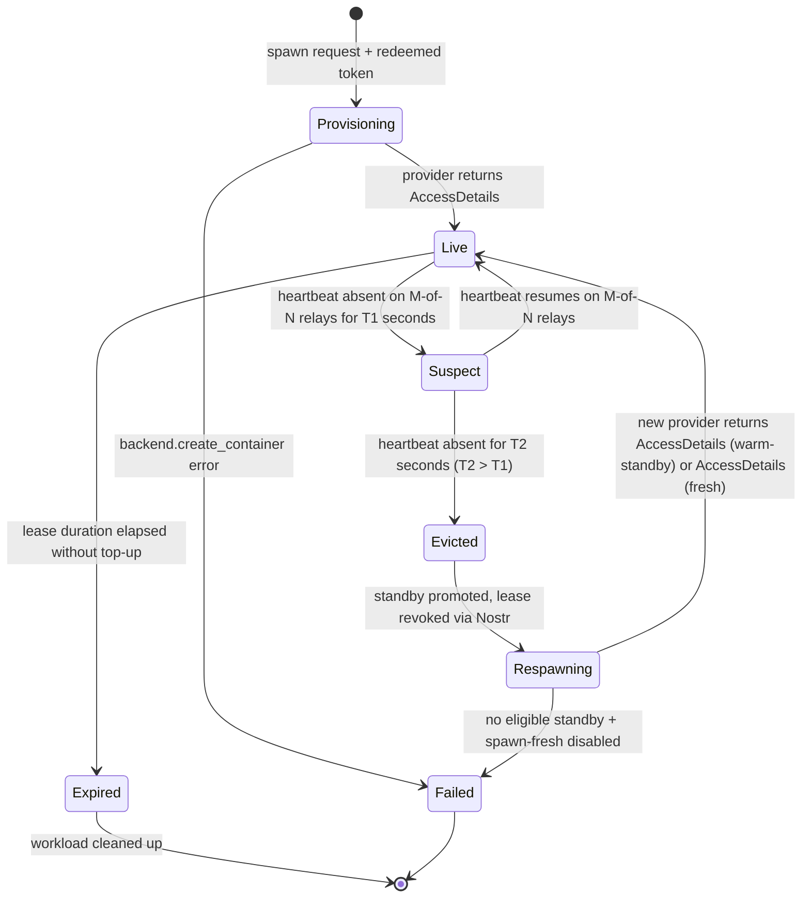
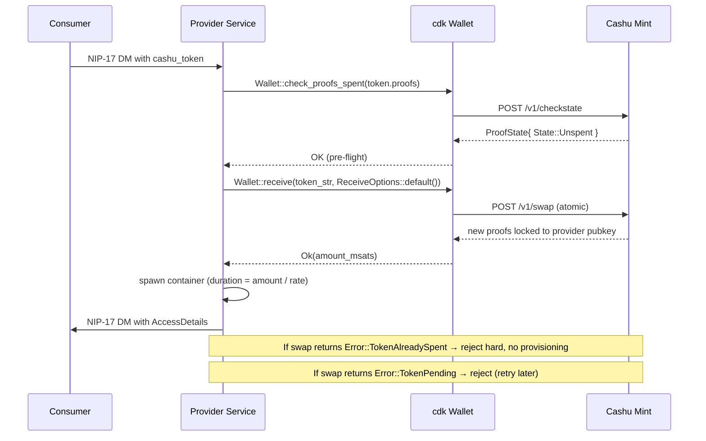

# Paygress 12-Month Vision Implementation Plan

## Overview

Twelve-month implementation plan for the Paygress decentralized compute marketplace, funded by a $300K OpenSats / HRF / Spiral grant supporting two engineers + $60K hardware. Hardens the working MVP (Cashu ecash + Nostr DMs + LXD/Proxmox/K8s backends) into a system that two distinct audiences — freedom-tech operators and AI agents — can rely on.

The plan is organized into four quarterly phases. Phase 0 (Q1) is foundational: payment correctness, the Durable Workload abstraction, and the first flagship template. Each subsequent phase layers a Pillar from the brainstorm onto a working core.

## Problem Frame

Paygress today is an MVP that lets a consumer rent a Linux container on a stranger's hardware by sending a Cashu token over Nostr. The substrate works, but the system is not yet trustworthy for the audiences it is built for:

- **No fault-tolerance contract.** Compute disappears at any moment with no automatic recovery. Stateful workloads (Nostr relays, Cashu mints, Bitcoin nodes) are operationally exposed.
- **No trust layer.** Consumers cannot distinguish honest from malicious providers; providers cannot prove tenant isolation.
- **No demand pull.** "Rent a container with sats" is too generic for the grant audience or the latent agent-economy audience — both need turnkey workloads, not bare containers.
- **No agent-native surface beyond the MCP scaffold.** The MCP server exists but routes only to the deprecated K8s path; the SDKs and streaming top-up that would make this *the* compute layer for autonomous agents are not yet shipped.
- **Foundational payment-correctness gap.** `src/cashu.rs` only decodes face value; the Nostr-DM provider path never redeems tokens at the mint. A token can be replayed across N providers undetected. This is treated as a P0 prerequisite blocking every trust requirement above it.

(Origin: docs/brainstorms/2026-04-26-paygress-12mo-vision-requirements.md, §"Problem Frame".)

## Requirements Trace

Carried forward from the origin document. Stable IDs preserved.

**Payment correctness (P0 prerequisite):**
- R0a. Wire `cdk` mint redemption into the Nostr-DM provider path (`src/provider.rs`).
- R0b. Port single-shot TopUp from K8s/`pod_provisioning.rs` into the Nostr-DM provider path.

**Audience and positioning:**
- R1. Dual audience (freedom-tech + agents); freedom-tech invariants as tiebreaker.
- R2. Two-layer payment narrative: Cashu for leases; L402 as opt-in pattern with `inference-endpoint` as year-1 reference.

**Pillar 1 — Reliability primitives:**
- R3. Durable Workload abstraction (`{manifest, state_uri, replication, restart_policy}`); `replication ∈ {none, warm-standby}`; single-writer always.
- R4. Heartbeat → lease-revocation → standby-promotion → respawn state machine; M-of-N relay quorum for eviction; signed heartbeats.
- R5. Encrypted Blossom (BUD-04) checkpoints; client-side XChaCha20-Poly1305; hashes communicated over encrypted DMs only.
- R6. Premium-tier adapter pattern. **Decision per Phase 0.5: LNVPS dropped from year 1; in-marketplace stake-weighted premium tier instead** — fidelity-bond-inspired locked-Bitcoin reputation.

**Pillar 2 — Trust and reputation:**
- R7. Signed completion receipts (provider co-signed + bound to verifiable payment proof); Sybil-weighted score function; conservative defaults (30-day history minimum, 20% single-counterparty cap, 5 anchor providers seeded by the team).
- R8. Optional provider stake escrow with consumer-chosen arbiter relay. **Cut-ladder candidate** — year-1 may ship spec-only.
- R9. **Demoted to year-2 research deliverable.** Year-1 ships threat model + reference attestation values + working demo on rented attested instances + self-declared `isolation_level` offer tag.
- R10. Public read-only observatory: static frontend + reproducible scheduled aggregator; opt-in coarse-grained jurisdiction disclosure.

**Pillar 3 — Killer templates:**
- R11. Three flagship templates: `nostr-relay` (Q1), `inference-endpoint` (Q2), `headless-browser` (Q3).
- R12. Four beta templates: `tor-bridge`, `cashu-mint`, `bitcoin-node`, `ngit-build-runner`. Cut-ladder may reduce to 2 (`tor-bridge` + `cashu-mint`).
- R13. Templates referenced by content-addressed hash on Nostr (replaces project-key signing — cleaner than maintaining a project signing-key root).

**Pillar 4 — Agent-native surface:**
- R14. MCP tools (rmcp 0.2.1) covering spawn / topup / status routed to the Nostr-DM control plane.
- R15. Streaming Cashu top-up via chunked top-up every N seconds (default 60s); sub-second streaming-NUT extension explicitly out of year-1 scope.
- R16. Rust SDK (canonical) + thin Python wrapper (subprocess) + TS types codegen from JSON schemas.
- R17. L402 paywall pattern with `inference-endpoint` as year-1 reference; per-tenant `ngx_l402` sidecar.

**Cross-cutting:**
- R18. Paygress NIP published by month 9; explicit `version` field in offer/heartbeat/lease payloads from day one; external co-author / lighthouse implementer recruited before draft publication.
- R19. Security audit (Q3 kickoff, Q4 remediation window) covering tenant isolation, payment-flow correctness, Nostr-DM replay/race conditions, escrow soundness if R8 ships, Blossom-checkpoint encryption.
- R20. Provider one-click bootstrap on three jurisdictions; ≥10 providers across ≥5 jurisdictions, prioritizing Global South. Resourced by R22.
- R21. Opinionated `paygress deploy <template>` CLI hiding reliability/persistence/replication knobs behind sane defaults.
- R22. Provider DevRel allocation (paid role from grant or reallocated engineering hours).
- R23. Abuse-response policy for `inference-endpoint` and `headless-browser`.

## Scope Boundaries

- **Out of scope:** SaaS web app or hosted dashboard product; the observatory is a static frontend backed by a reproducible aggregator.
- **Out of scope:** Token issuance, governance DAO, or revenue-sharing economics on top of sats.
- **Out of scope:** Custom Cashu mint implementation; reuse `cdk` 0.9 / nutshell.
- **Out of scope:** Mobile clients.
- **Out of scope:** Live-migration with cooperative providers (CRIU/Proxmox-migrate). Reliability is delivered by warm-standby restart from encrypted Blossom checkpoint.
- **Out of scope:** Concurrent N-way replication with consensus. Replication is single-writer warm-standby always.
- **Out of scope:** "Fully Nostr-based control plane" in the strong sense of consensus on Nostr.
- **Out of scope (year 1):** Productized TEE-attested tier. R9 is research-only; year-1 isolation is a self-declared tag with no cryptographic claim. Note research finding: any future TEE tier requires architectural shift from LXC to SEV-SNP qemu guests (LXC + memory isolation is physically impossible due to shared kernel).
- **Out of scope (year 1):** Sub-second streaming Cashu protocol; year-1 ships chunked top-up.
- **Out of scope (year 1):** L402 paywalls on `headless-browser`, `cashu-mint`, or other API-exposing templates beyond the `inference-endpoint` reference.
- **Out of scope (year 1):** LNVPS adapter (decision per Phase 0.5).
- **Out of scope (year 1):** DLC-based automated slashing of provider stake.

### Deferred to Separate Tasks

- **LNVPS adapter** — Year-2 optional add-on if LNVPS engages; not on the year-1 critical path.
- **TEE productization (R9)** — Year-2; requires SEV-SNP qemu substrate and budget for attested hardware.
- **Hand-rolled Python and TypeScript SDKs (full reimplementation of durable-workload + MCP + streaming surfaces)** — Year-2; year-1 ships thin wrappers + codegen only.
- **`bitcoin-node` and `ngit-build-runner` beta templates** — Year-2 if cut-ladder triggered in Q4.
- **Streaming-NUT Cashu spec extension** — Stretch goal contingent on `cdk` maintainer cooperation.

## Context & Research

### Relevant Code and Patterns

- **Backend trait:** `src/compute.rs:31-53` defines `ComputeBackend` (async, 7 methods) implemented by `LxdBackend` (`src/lxd.rs:12-248`, shells out to `lxc` CLI) and `ProxmoxBackend` (`src/proxmox.rs:561-644`, wraps `ProxmoxClient`). Dispatch: `ProviderService::new` at `src/provider.rs:156-201` matches `BackendType` and stores `Arc<dyn ComputeBackend>`. **K8s is NOT behind this trait** — it lives in `src/sidecar_service.rs` + `src/pod_provisioning.rs` as a parallel pipeline. The trait is the right extension point for any new backend; the K8s path will be gated behind a `kubernetes` Cargo feature and frozen.
- **Cashu handling (current):** `src/cashu.rs` is 60 lines total. Only `extract_token_value()` (face-value decode, no redemption); a `static OnceLock` for `cdk_redb` storage that is set but never read; comment at line 30 references a removed `verify_cashu_token` function. Provider consumes via `extract_token_value` at `src/provider.rs:455`. `whitelisted_mints` field is published in offers (`src/provider.rs:244`) but never enforced server-side.
- **Provider service / Nostr-DM flow:** `ProviderService::run` (`src/provider.rs:209-232`) runs three concurrent loops via `tokio::select!` — `heartbeat_loop` (lines 255-264), `listen_for_requests` (lines 303-395), `cleanup_loop` (lines 398-436). Dispatch table at `src/provider.rs:350-388` matches `PrivateRequest::{Spawn, TopUp, Status}`. **`PrivateRequest::TopUp(_)` is explicitly stubbed at `src/provider.rs:378-387`** — replies "TopUp is not yet implemented on this provider".
- **Nostr offers / heartbeats:** `src/nostr.rs:14-15` defines `KIND_PROVIDER_OFFER = 38383` and `KIND_PROVIDER_HEARTBEAT = 38384`. Offer published via `publish_provider_offer` (`src/nostr.rs:633-659`) with parameterized-replaceable `d` tag = provider npub. **Heartbeat published with no `d` tag** (`src/nostr.rs:670`) — but kind 38384 is in the addressable range (30000-39999), so each new heartbeat replaces the prior. `calculate_uptime` (`src/nostr.rs:809-826`) expects historical heartbeats, so this is a structural bug to fix.
- **MCP server:** `src/mcp/server.rs` does NOT use the `rmcp` crate despite `rmcp = "0.2.1"` being in `Cargo.toml:60`. The current implementation is hand-rolled JSON-RPC over stdio with a single `match tool_name` dispatcher (`src/mcp/protocol.rs:93-423`) routing to `PaywalledHttpClient` (HTTP path → K8s pipeline). Tools today: `spawn_pod`, `topup_pod`, `get_offers`, `get_pod_status`. R14 redirects these to the Nostr-DM control plane.
- **CLI structure:** `src/cli/main.rs:11-90` uses clap derive with a flat `Commands` enum (lines 27-52). Each subcommand lives in `src/cli/commands/<name>.rs` exporting `<Name>Args` + `pub async fn execute(args, verbose) -> anyhow::Result<()>`. Sub-subcommand pattern (e.g., `provider {setup, start, stop, status, config, tunnel}`) at `src/cli/commands/provider.rs:17-42`. New `paygress deploy` subcommand mirrors this shape.
- **Service/state-machine patterns:** No formal state-machine type exists. `WorkloadInfo` (`src/provider.rs:129-137`) holds implicit state via fields. `cleanup_loop` polls every 30s and removes expired workloads. The new heartbeat-driven state machine (R4) extends the `tokio::select!` triple-loop pattern with a fourth loop owning a state-machine type.
- **WireGuard tunnel pattern:** `paygress-cli provider tunnel` at `src/cli/commands/provider.rs:447-583` is the existing precedent for "Cashu-paid HTTP request fetches an external service config, persists to `/etc/<service>/`, mutates `/etc/paygress/provider-config.json`". `ProviderConfig` already uses `#[serde(default)]` for new optional fields (`src/provider.rs:75-83`) — same pattern for any new fields R0a/R3/R4 add.
- **Tests:** No `tests/` directory. Only two inline `#[cfg(test)] mod tests` modules (`src/proxmox.rs:530-554`, `src/discovery.rs:286-318`). No `#[tokio::test]` async tests. No `dev-dependencies`. Test infrastructure is greenfield (Unit 3).
- **CI:** No `.github/`, no GitHub Actions, no Makefile. Greenfield (Unit 3).
- **Project conventions:** No `AGENTS.md`, no `CLAUDE.md`, no `CONTRIBUTING.md`. Module purpose is documented in file-level header comments (`src/cashu.rs:1-4`, `src/lxd.rs:1-3`, `src/provider.rs:1-6`). New modules should keep this convention.

### Institutional Learnings

- **`docs/solutions/` does not exist.** No prior institutional knowledge to cite. The plan is greenfield from a learnings standpoint.
- **Recommendation carried into the plan:** Bootstrap `docs/solutions/` as part of Q1 (covered in Unit 3); seed entries from Q1 work (cdk redemption integration, Nostr heartbeat fix, escrow design) using the `compound-engineering:ce-compound` skill after each lands.

### External References

- **Cashu double-spend prevention (Routstr precedent):** [Routstr core](https://github.com/Routstr/routstr-core) and [docs.routstr.com](https://docs.routstr.com/) ship the canonical pattern: `POST /v1/checkstate` (NUT-07) for pre-flight, then `POST /v1/swap` (NUT-03) for atomic redemption. Provider-pubkey-locked outputs prevent any third-party from spending. **This is what R0a copies.**
- **cdk 0.9 wallet API** (`docs.rs/cdk/0.9.0/cdk/`): `Wallet::receive(&self, encoded_token, ReceiveOptions::default()) -> Result<Amount, Error>`. Match `Error::TokenAlreadySpent` and `Error::TokenPending` as terminal "do-not-provision" outcomes. Pre-flight via `Wallet::check_proofs_spent` returning `Vec<ProofState>` with `State::Spent`.
- **nostr-sdk 0.33 quorum primitives:** No built-in M-of-N quorum API. Build from `Output<T>` (`success: HashSet<Url>`, `failed: HashMap<Url, _>`) returned by `RelayPool::send_event_to`/`batch_event`, and `RelayPoolNotification::Event { relay_url, .. }` for per-relay event arrival. The plan promotes the currently-ignored `relay_url` at `src/nostr.rs:108` into per-relay quorum tracking.
- **rmcp 0.2.1 patterns** (`docs.rs/rmcp/0.2.1`): `#[tool_router]` on impl block, `#[tool]` on each handler, `#[tool_handler]` on `ServerHandler` impl, `Parameters<T>` wrapper for typed args, `CallToolResult::success(vec![Content::text(...)])` for output. Stdio via `rmcp::transport::io::stdio()`.
- **Blossom (BUD-01/02/04):** [hzrd149/blossom](https://github.com/hzrd149/blossom). `nostr-blossom` crate exists but pins nostr 0.44 (incompatible with our nostr-sdk 0.33). Roll-our-own ~150 lines on top of `reqwest 0.11` (already in tree). Auth event is kind 24242 with `t`/`x`/`expiration` tags, base64-encoded JSON in `Authorization: Nostr <b64>` header.
- **L402 for Agents (Lightning Labs, March 2026):** [lightning.engineering/posts/2026-03-11-L402-for-agents](https://lightning.engineering/posts/2026-03-11-L402-for-agents/) positions L402 as the agent-payment standard for HTTP. Validates the per-tenant `ngx_l402` sidecar approach for `inference-endpoint`.
- **Tokenless Sybil resistance via fidelity bonds:** [JoinMarket fidelity bonds](https://github.com/JoinMarket-Org/joinmarket-clientserver/blob/master/docs/fidelity-bonds.md) — battle-tested for ~7 years in Bitcoin coinjoin. Reputation = `log(sats × time-locked)`. Direct port for R6 in-marketplace premium tier and R7 Sybil weighting: providers post a timelock-locked Bitcoin UTXO; lock proof becomes part of the offer event.
- **NIP versioning patterns:** Add tags, don't break kind unless semantics break. NIP-44 v1→v2 cohabited 6 months. Use `["v","2"]` tag inside addressable events. For Kinds 38383/38384 specifically: sub-namespace in `d` tag (e.g., `paygress:offer:v2:<npub>`) for any breaking schema change. Heartbeat fix per research: move to ephemeral kind 20384, OR keep 38384 with timestamped `d` tag.
- **AMD SEV-SNP attestation (`virtee/sev`):** [github.com/virtee/sev](https://github.com/virtee/sev). Production-ready Rust crate; `crypto_nossl` feature for pure-Rust verification. Bare-metal recipe documented by AMD ([58217-epyc-9004-ug-platform-attestation](https://www.amd.com/content/dam/amd/en/documents/developer/58217-epyc-9004-ug-platform-attestation-using-virtee-snp.pdf)). For year-1 R9: build attestation-verification harness against virtee/sev on rented attested instances; do not promise an LXC tier (architecturally impossible).
- **NIP-90 Data Vending Machines:** [nips.nostr.com/90](https://nips.nostr.com/90). Architectural blessing for `ngit-build-runner` (R12 beta): job-request/job-result event shapes; ngit's stated direction (per DanConwayDev) is exactly this. [Radicle CI](https://radicle.xyz/2025/07/23/using-radicle-ci-for-development) provides the COB→runner shape worth borrowing.

## Key Technical Decisions

- **Canonical control plane = Proxmox-LXD + Nostr-DM (Phase 0.5 decision).** All new work centers `src/provider.rs` + `src/lxd.rs` / `src/proxmox.rs`. The K8s + ngx_l402 + HTTP path (`src/sidecar_service.rs`, `src/pod_provisioning.rs`, `src/interfaces/http_l402.rs`) is gated behind a `kubernetes` Cargo feature and frozen. Rationale: aligns with R1 freedom-tech tiebreaker; the marketplace IS the Nostr-DM path; eliminates the "two control planes" capacity drain flagged in document review.
- **LNVPS dropped from year 1; in-marketplace stake-weighted premium tier instead (Phase 0.5 decision).** R6 is implemented as a fidelity-bond-inspired locked-Bitcoin reputation tier, not as an LNVPS adapter. Rationale: removes the unconfirmed third-party dependency that the document review flagged; the in-marketplace tier is fully under team control; LNVPS adapter remains a year-2 optional add-on if the org engages.
- **Sybil weighting starting parameters: 30-day history minimum, 20% single-counterparty cap, 5 anchor providers (Phase 0.5 decision).** Tunable post-R19 audit. Rationale: matches the recommended-conservative profile; bootstrap-friendly without being trivially gameable.
- **Cashu redemption uses `Wallet::receive()` (swap-on-receive), not `melt`.** Provider receives a Cashu token over Nostr DM and immediately swaps it into provider-pubkey-locked outputs at the same mint. Rationale: NUT-03 swap is the only race-free way to mark proofs spent; matches the Routstr production pattern; keeps value as ecash for the provider.
- **Heartbeat schema fix during R4 implementation.** Move heartbeats from addressable kind 38384 to ephemeral kind 20384 (1000-9999 regular, 20000-29999 ephemeral) AND add a `version` tag from day one. Rationale: addressable kind without `d` tag was a structural bug; ephemeral kind matches "right-now liveness" semantics; ephemeral events are not stored at relays (which is correct for heartbeats — we read live, not historical).
- **Blossom client rolled in-tree, not via `nostr-blossom` crate.** ~150 lines on top of `reqwest 0.11` + `chacha20poly1305 0.10` + `sha2 0.10`. Rationale: `nostr-blossom 0.44` requires nostr 0.44 (incompatible with our nostr-sdk 0.33); upgrading the entire Nostr stack is its own multi-week migration that should not block Q1.
- **MCP migrates to rmcp 0.2.1 in Q3 (R14).** The `rmcp` crate is already in `Cargo.toml` but unused; the existing hand-rolled JSON-RPC server is replaced with `#[tool_router]` + `ServerHandler`. Rationale: rmcp gives typed parameters, schema-derived `tools/list`, and a real handshake protocol; aligns with the broader Rust MCP ecosystem; eliminates the need to maintain two registration paths.
- **Per-tenant `ngx_l402` sidecar deployment for `inference-endpoint` (R17).** L402 paywall terminates inside each tenant's LXC container, not at a shared cluster front door. Rationale: matches the Proxmox-LXD canonical control plane (no shared nginx); aligns with Lightning Labs' L402-for-Agents direction; tenant controls pricing and LN node. Trade-off: ops surface area is larger; documented as such.
- **Templates referenced by content-addressed hash on Nostr (R13 redesign).** Replaces "signed by Paygress project keys" with "consumer-fetches-template-by-Nostr-event-hash from any mirror." Rationale: removes a project-key trust root that contradicts the "no Paygress-controlled state" boundary; aligns with how Blossom already addresses content; eliminates key-management overhead the document review flagged.
- **Test infrastructure and CI are Q1 work, not assumed.** Adding `tests/` directory, `dev-dependencies` (`tokio-test`, `mockito`/`wiremock`, `proptest`), and a GitHub Actions workflow for `cargo test` + `cargo clippy` + `cargo fmt --check`. Rationale: the codebase has only 2 inline tests today; security-critical changes (R0a, R5) require proper test coverage from day one.
- **Year-1 R9 is research, not a tier.** Threat model + virtee/sev demo on rented attested instances + offer-tag `isolation_level ∈ {shared-kernel, dedicated-host, attested-research-tier}`. No cryptographic claim about what the consumer can verify. Rationale: LXC + memory isolation is physically impossible (shared kernel); SEV-SNP requires qemu guests not LXC; honest scoping per origin doc.
- **Anchor providers seeded by the Paygress team for Q2 reputation bootstrap.** Five providers run by the team and Dhananjay/Ritik with public completion logs, listed in the observatory as "anchor" with a flag. Rationale: solves the cold-start reputation paradox the document review flagged; makes the receipt corpus non-empty at Q2 launch.

## Open Questions

### Resolved During Planning

- **Which control plane is canonical?** Proxmox-LXD + Nostr-DM. K8s path frozen behind `kubernetes` Cargo feature.
- **LNVPS engagement?** Dropped from year 1; in-marketplace stake-weighted premium tier instead.
- **Sybil weighting parameters?** 30-day history, 20% single-counterparty cap, 5 anchor providers (conservative defaults).
- **How does the Cashu redemption fit cdk 0.9 idiomatically?** `Wallet::receive(token_str, ReceiveOptions::default())` matched against `Error::TokenAlreadySpent` and `Error::TokenPending`; pre-flight via `Wallet::check_proofs_spent`.
- **Blossom client: external crate or roll our own?** Roll our own (`src/blossom.rs`); `nostr-blossom 0.44` incompatible with nostr-sdk 0.33.
- **Heartbeat kind migration?** Move to ephemeral kind 20384; add `version` tag.
- **Template trust root?** Content-addressed Nostr-event hash; no project signing keys.
- **MCP scaffold?** Migrate to rmcp 0.2.1 in Q3 (R14); replace hand-rolled JSON-RPC.

### Deferred to Implementation

- [Affects R0a][Technical] Where should the per-mint `Wallet` instance live in `ProviderService`? Lazily-initialized `DashMap<MintUrl, Arc<Wallet>>` or eagerly-initialized at startup from `whitelisted_mints` config? Likely lazy with TTL eviction; finalize during Unit 1.
- [Affects R3, R5][Technical] Encrypted-checkpoint key derivation: per-lease ephemeral key (best privacy, harder recovery) vs. consumer-Nostr-key-derived (easier recovery, weaker forward secrecy)? Decide during Unit 6 based on `nostr-sdk 0.33` key-derivation primitives.
- [Affects R4][Technical] M-of-N quorum tunables: M=2 of N=3 default? M=3 of N=5? User-configurable per-workload? Likely default M=2 N=3 with override in `restart_policy`; finalize during Unit 5.
- [Affects R7][Needs research] Score function exact formula. Linear weights vs. logarithmic decay vs. Bayesian prior? Decide during Unit 10 after surveying Akash/Render/Pocket scoring.
- [Affects R11][Technical] `inference-endpoint` model server: vLLM (CUDA-only) vs. llama.cpp (CPU-friendly) vs. SGLang? Default to llama.cpp + GPU-detection branch to vLLM; finalize during Unit 13 after seeing what hardware Q1 onboarding produces.
- [Affects R15][Technical] Chunked top-up tick interval default: 60s, 300s, or per-spec? Default 60s with override in offer; finalize during Unit 16.
- [Affects R18][Needs research] NIP overlap with NIP-38383 marketplace: superset, parallel, or supersede? Survey during Unit 18 NIP authoring.
- [Affects R20, R22][User decision] DevRel allocation source — paid role from grant or reallocated engineering hours? **Promoted to Resolve Before Planning per Risk Analysis row** (waiting until Q4 contradicts the mitigation). Decision needed by end of Q1 month 1; if reallocated engineering hours, R20 publicly restated to "≥5 providers, ≥3 jurisdictions, best-effort Global South" before grant kickoff.
- [Affects R7][Stakeholder validation] Sybil-weighting parameters (30/20/5) were resolved during planning as "conservative defaults." The origin doc classified this as a "User decision." Validate with funder representatives and any external reputation-system reviewers in Q1 month 1; reset before Unit 10 implementation if a different profile is preferred.

## Output Structure

```
docs/
├── brainstorms/
│   └── 2026-04-26-paygress-12mo-vision-requirements.md  (origin)
├── plans/
│   └── 2026-04-26-001-feat-paygress-12mo-vision-plan.md  (this plan)
└── solutions/                                            (new in Unit 3)
    └── patterns/
        └── critical-patterns.md                          (seeded incrementally)

src/
├── blossom.rs                  (new — Unit 6: BUD-01/02/04 client + encryption)
├── cashu.rs                    (modified — Unit 1: redemption)
├── cli/commands/
│   └── deploy.rs               (new — Unit 9: opinionated paygress deploy)
├── compute.rs                  (existing — backend trait, no changes)
├── discovery.rs                (modified — Unit 4: heartbeat schema)
├── durable_workload.rs         (new — Unit 5: state machine)
├── lib.rs                      (modified — Unit 7: kubernetes feature gate)
├── mcp/                        (rewritten — Unit 15: rmcp migration)
├── nostr.rs                    (modified — Unit 4: heartbeat fix, version tag)
├── observatory/                (new — Unit 12: aggregator + frontend)
│   ├── aggregator.rs
│   └── static-site/
├── provider.rs                 (modified — Units 1, 2, 5, 11: redemption, topup, state machine, premium tier)
├── reputation.rs               (new — Unit 10: signed receipts + Sybil score)
└── templates/                  (new — per-template manifests)
    ├── nostr-relay/            (Unit 8)
    ├── inference-endpoint/     (Unit 13, with ngx_l402 sidecar config)
    ├── headless-browser/       (Unit 19)
    ├── tor-bridge/             (Unit 21)
    └── cashu-mint/             (Unit 21)

sdks/                           (new — Unit 17)
├── python/                     (thin subprocess wrapper)
└── typescript/                 (codegen target)

tests/                          (new — Unit 3: integration tests)
├── cashu_redemption.rs
├── durable_workload.rs
└── provider_e2e.rs

.github/                        (new — Unit 3)
└── workflows/
    └── ci.yml                  (cargo test + clippy + fmt)
```

## High-Level Technical Design

> *This illustrates the intended approach and is directional guidance for review, not implementation specification. The implementing agent should treat it as context, not code to reproduce.*

### Warm-standby state machine (R3, R4)

Each Durable Workload instance flows through this state machine, driven by Nostr Kind 20384 heartbeat observations and lease-revocation events. Only one replica holds the write lease at any instant.



Key invariants the state machine must preserve:
- Only one replica is `Live` at any instant (single-writer always).
- Eviction requires M-of-N relay observations agreeing on heartbeat absence — single-relay outage cannot fake death.
- Lease revocation is published on Nostr before standby is promoted, so the deposed provider can stop serving.
- For `replication=none` workloads, `Evicted → Respawning` triggers a fresh spawn from the latest Blossom checkpoint (or fails if checkpoint absent and template is stateful).

### Cashu redemption flow (R0a)



### NIP versioning approach (R18)

```
Offer event content (Kind 38383):
{
  "version": 1,                    ← added day one; bumped on breaking changes
  "provider_npub": "...",
  "hostname": "...",
  "specs": [...],
  "isolation_level": "shared-kernel" | "dedicated-host" | "attested-research-tier",
  "stake_proof": null | { ... },   ← added Unit 11 for premium tier
  ...
}

Tags:
  ["d", "paygress:offer:v1:<npub>"]   ← versioned d-tag enables clean v2 cohabitation
  ["v", "1"]                          ← redundant with content.version, surfaces in tag-only filters
  ["paygress"], ["compute"]
```

## Implementation Units

### Phase Q1 — Foundation (Months 1-3)

- [ ] **Unit 1: Wire `cdk` mint redemption into Nostr-DM provider path**

**Goal:** Replace face-value-only Cashu handling with provable redemption at the mint. Eliminates token-replay attacks across providers.

**Requirements:** R0a, R2, R7 (precondition).

**Dependencies:** Unit 3 (test infrastructure) for safe verification.

**Files:**
- Modify: `src/cashu.rs` — replace `extract_token_value` with `redeem_token(wallet, token_str) -> Result<u64>`; add per-mint `Wallet` instance management.
- Modify: `src/provider.rs:455` — call `redeem_token` instead of `extract_token_value`.
- Modify: `src/provider.rs` (handle_spawn_request, lines 442-628) — handle redemption errors before any backend call.
- Modify: `Cargo.toml` — confirm `cdk = "0.9.0"` features cover wallet API (already present).
- Test: `tests/cashu_redemption.rs` (new integration tests) + inline unit tests in `src/cashu.rs`.

**Approach:**
- Lazily initialize `Wallet` per-mint via a `tokio::sync::DashMap<MintUrl, Arc<Wallet>>` on `ProviderService` (defer key-derivation choice to implementation; default to provider-Nostr-key-derived for now).
- On spawn request: pre-flight `Wallet::check_proofs_spent`; immediately call `Wallet::receive(token_str, ReceiveOptions::default())`; match `Error::TokenAlreadySpent` / `Error::TokenPending` as terminal rejections.
- Enforce `whitelisted_mints` server-side: reject before redemption if `token.mint_url()` not in offer's whitelist.
- Carry redeemed `proofs.amount` into the existing duration calculation at `src/provider.rs:494`.
- **`extract_token_value` is kept in `src/cashu.rs` as a deprecated shim that delegates to `redeem_token` for the duration of Unit 1 → Unit 7.** Four callsites exist: `src/provider.rs:455` (Nostr-DM, primary target), `src/sidecar_service.rs:715` (K8s wrapper), `src/pod_provisioning.rs:340` + `:586` (K8s spawn/topup), `src/interfaces/http_l402.rs:70` (HTTP path). Unit 1 swaps the Nostr-DM callsite to `redeem_token` directly; the K8s/HTTP callsites continue to use `extract_token_value` (which now redeems internally) until Unit 7 feature-gates the K8s path. This avoids a multi-file simultaneous change before the kubernetes Cargo feature lands.

**Execution note:** Characterization-first. Add integration tests covering (a) double-spent token rejected, (b) wrong-mint rejected, (c) successful redemption returns expected amount, BEFORE replacing `extract_token_value`. The current behavior is silently broken; characterize what we want it to do.

**Patterns to follow:**
- Routstr's swap-on-receive flow ([github.com/Routstr/routstr-core](https://github.com/Routstr/routstr-core)).
- Existing per-mint configuration pattern at `src/nostr.rs:585-596` (`whitelisted_mints` is already in offer content).
- `ProviderService::new` (`src/provider.rs:156-201`) for initialization wiring.

**Test scenarios:**
- *Happy path:* Token from whitelisted mint, never-spent proofs → `redeem_token` returns expected msats; `provider.handle_spawn_request` proceeds to backend.
- *Error path:* Token from whitelisted mint, already-spent proofs → `redeem_token` returns `Err(TokenAlreadySpent)`; provider replies error; **no container is created**; tested by mocking the backend and asserting `create_container` is not called.
- *Error path:* Token from non-whitelisted mint → reject before redemption; provider replies error.
- *Error path:* Token in `Pending` state → treat as not-yet-spent; reject with retry hint; **no container created**.
- *Edge case:* Token whose `mint_url()` is reachable but mint returns 5xx → wrap in `Error::Network`; reject with retry hint; no container.
- *Integration:* Replay the same valid token twice from two separate Nostr DMs to one provider → first succeeds, second is rejected as `TokenAlreadySpent` (proves swap-on-receive prevents in-provider replay).
- *Integration:* Replay the same valid token across two providers (same mint) → exactly one swap succeeds at the mint; the other provider gets `TokenAlreadySpent` (proves cross-provider replay defeated).

**Verification:**
- `tests/cashu_redemption.rs` passes against a local nutshell mint stub.
- Manually paying for one spawn against a real testnet mint succeeds; replaying the same token fails.
- No regression in `src/sidecar_service.rs` (K8s path) — the K8s path is unchanged in this unit.

---

- [ ] **Unit 2: Port single-shot TopUp to Nostr-DM provider path**

**Goal:** Implement TopUp on the Nostr-DM provider path; remove the stub at `src/provider.rs:378-387`. Prerequisite for R15 streaming.

**Requirements:** R0b, R15 (precondition).

**Dependencies:** Unit 1 (redemption is required before extending lease).

**Files:**
- Modify: `src/provider.rs` — replace TopUp stub at lines 378-387 with real handler; mirror the `handle_spawn_request` shape.
- Modify: `src/nostr.rs` — confirm `PrivateRequest::TopUp` payload (already defined at lines 550-556) covers the parameters needed; add `lease_id` if missing.
- Modify: `src/cli/commands/topup.rs` — wire CLI to send TopUp via Nostr (existing CLI exists; verify it routes correctly).
- Test: `tests/topup.rs` (new integration tests).

**Approach:**
- New `handle_topup_request(req)`: look up workload in `active_workloads` by `lease_id`/`workload_id`; reject if not found or expired.
- Redeem the supplied token (Unit 1's `redeem_token`); compute `extension_secs = redeemed_msats / spec.rate_msats_per_sec`.
- Update `WorkloadInfo.expires_at += extension_secs` under the existing `Mutex<HashMap>` lock (`src/provider.rs:144`).
- Reply with updated `expires_at` over Nostr DM.

**Patterns to follow:**
- `pod_provisioning.rs:510-691` (existing TopUp on K8s path) — port the logic, not the K8s coupling.
- `handle_spawn_request` (`src/provider.rs:442-628`) — same redemption + reply shape.
- WorkloadInfo mutation pattern (search `active_workloads.lock()` in `src/provider.rs`).

**Test scenarios:**
- *Happy path:* Valid token + active lease → `expires_at` extended by computed duration; reply contains new expiry.
- *Error path:* TopUp for unknown `lease_id` → reject with `not_found`; no state change.
- *Error path:* TopUp for already-expired lease → reject with `lease_expired`; no state change.
- *Error path:* Token redemption fails (any case from Unit 1) → reject; expiry unchanged.
- *Edge case:* Two concurrent TopUp DMs for the same lease → both either succeed atomically or one is rejected; test serializes via the mutex — extension is idempotent or strictly additive.
- *Integration:* Spawn a 60-second lease, send TopUp at t=30s, observe lease lives until t=120s (proves TopUp reaches `cleanup_loop`).

**Verification:**
- TopUp works end-to-end via `paygress-cli topup --pod-id <id> --provider <npub> --token <cashu>`.
- No regression in spawn or status flows.

---

- [ ] **Unit 3: Test infrastructure, CI baseline, and `docs/solutions/` bootstrap**

**Goal:** Establish testing primitives the rest of the plan depends on. The codebase has 2 inline tests and no CI today; security-critical R0a/R5 work cannot proceed safely without this.

**Requirements:** Cross-cutting; no specific R-id.

**Dependencies:** None — first work item of Q1, runs in parallel with Unit 1's characterization tests.

**Files:**
- Create: `tests/` directory with `tests/cashu_redemption.rs` (placeholder), `tests/durable_workload.rs` (placeholder).
- Create: `.github/workflows/ci.yml` — `cargo test`, `cargo clippy --all-targets -- -D warnings`, `cargo fmt --check`.
- Create: `docs/solutions/README.md` — schema for institutional learnings (problem_type, component, root_cause, symptoms, tags, severity per the `compound-engineering:ce-compound` skill format).
- Create: `docs/solutions/patterns/critical-patterns.md` — initial entries for known anti-patterns (e.g., "extract_token_value without redemption is double-spend-vulnerable").
- Modify: `Cargo.toml` — add `[dev-dependencies]` block: `tokio-test = "0.4"`, `wiremock = "0.5"` (for mint-stub HTTP), `proptest = "1"`, `tempfile = "3"`.
- Modify: `Cargo.toml` — add `[features]` block introducing `kubernetes = ["dep:kube", "dep:k8s-openapi"]` (full deprecation lands in Unit 7).

**Approach:**
- Keep CI scope minimal (test, clippy, fmt). Defer release-build, security-scan, code-coverage to a future ops cycle.
- Use `wiremock` for mint-API mocks in `tests/cashu_redemption.rs`.
- `docs/solutions/` bootstrap is a one-page schema doc; entries are added incrementally as Q1 work surfaces gotchas.

**Patterns to follow:**
- `compound-engineering:ce-compound` skill schema for solution entries.

**Test scenarios:**
- Test expectation: none — this is infrastructure scaffolding. Verification is "CI runs green on a no-op PR."

**Verification:**
- A no-op PR triggers GitHub Actions and all three checks pass.
- `cargo test` from a clean clone runs the placeholder integration tests successfully.
- `docs/solutions/README.md` documents the schema; one seed entry exists.

---

- [ ] **Unit 4: Fix heartbeat replaceability bug + add `version` field to offer/heartbeat schemas**

**Goal:** Fix the structural bug in `src/nostr.rs` where heartbeats on addressable kind 38384 replace each other, breaking `calculate_uptime`. Add the explicit `version` field per R18 from day one.

**Requirements:** R4 (precondition), R18 (partial).

**Dependencies:** Unit 3 (CI catches schema regressions).

**Files:**
- Modify: `src/nostr.rs:14-15` — add `KIND_PROVIDER_HEARTBEAT_EPHEMERAL: u16 = 20384`; deprecate `KIND_PROVIDER_HEARTBEAT = 38384` with a comment pointing to migration plan.
- Modify: `src/nostr.rs:585-596` — add `version: u8` field to `ProviderOfferContent` (default `1`).
- Modify: `src/nostr.rs:600-606` — add `version: u8` field to `HeartbeatContent`. **Publish on BOTH the existing addressable kind 38384 (with `d` tag = `paygress:heartbeat:v1:<npub>:<timestamp_bucket>` for stored historical aggregation) AND the new ephemeral kind 20384 (for live-presence subscribers).** Ephemeral alone breaks the observatory's 30-day rolling window (Unit 12 aggregator polls every 6 hours; ephemeral events are not stored at relays). Stored-with-bucketed-`d`-tag fixes the original "addressable replaces" bug while preserving historical aggregation.
- Modify: `src/nostr.rs:585-596` (`ProviderOfferContent`) — add `isolation_level: IsolationLevel` field with `#[serde(default)]` (variants: `shared-kernel` | `dedicated-host` | `attested-research-tier`). Folded in here from Unit 22 — zero cost as a `#[serde(default)]` string field; surfaces R9 isolation tag earlier so observatory can display it from Q1.
- Modify: `src/nostr.rs:633-659` (publish_provider_offer) — add `["v", "1"]` tag and switch `d` tag to `paygress:offer:v1:<npub>`.
- Modify: `src/nostr.rs:662-684` (publish_heartbeat) — switch to ephemeral kind 20384; add `["v", "1"]` tag.
- Modify: `src/nostr.rs:739, 775` (query window hardcoded 5 min) — extract to constant; document as live-window only since ephemeral events are not stored.
- Modify: `src/nostr.rs:809-826` (calculate_uptime) — adapt to ephemeral-event semantics: now reads "presence over a sliding live window" rather than "stored event count."
- Modify: `src/discovery.rs:69, 151-156` (is_provider_online) — minor tweaks if the changed query semantics affect online detection.
- Test: `tests/nostr_schema.rs` (new) — round-trip serialize/deserialize for both schemas; verify `version` field tolerated by old-schema parsers (`#[serde(default)]`).

**Approach:**
- Both new fields use `#[serde(default = "default_version")]` so receiving a v0 payload from an old provider doesn't break parsing — the field defaults to `1`.
- Follow the wireguard-tunnel pattern of `#[serde(default)]` already used at `src/provider.rs:75-83`.
- Migration: existing providers running 0.1.4 keep publishing kind 38384; new providers publish both 38384 (legacy) and 20384 (canonical) for a one-revision compatibility window. Drop 38384 publishing in v0.2.0.
- Document the migration plan in a code comment at the deprecated constant.

**Patterns to follow:**
- `#[serde(default)]` precedent at `src/provider.rs:75-83`.
- NIP-44 v1→v2 cohabitation pattern (research finding).

**Test scenarios:**
- *Happy path:* Round-trip `ProviderOfferContent` v1 → bytes → v1; round-trip `HeartbeatContent` v1.
- *Edge case:* Deserialize v0 bytes (no `version` field) into v1 struct → `version = 1` by default; no error.
- *Edge case:* Deserialize v1 bytes with extra unknown field → unknown field ignored (forward-compat).
- *Integration:* Publish heartbeat on kind 20384 to a local Nostr relay (via wiremock or actual relay); subscribe with same kind filter; receive event.
- *Regression:* `calculate_uptime` returns sensible values (>0% for an actively-publishing provider, 0% for a silent one) under the new ephemeral semantics.

**Verification:**
- Existing provider using `paygress provider start` continues to publish offers; consumers using `paygress-cli list` see them.
- `paygress-cli list` shows online/uptime values that match expectations for a running provider.

---

- [ ] **Unit 5: Durable Workload abstraction + warm-standby state machine**

**Goal:** Implement R3 + R4. A workload is described by a structured manifest; the provider tracks workload state via an explicit state machine driven by Nostr heartbeat observations. Single-writer always.

**Requirements:** R3, R4, R6 (uses the state machine for premium-tier eligibility).

**Dependencies:** Unit 4 (heartbeat schema), Unit 1 (payment correctness — restart spawns a fresh redemption).

**Files:**
- Create: `src/durable_workload.rs` — defines `DurableWorkload` struct, `WorkloadState` enum, `WorkloadStateMachine` with `tick()` driven by heartbeat observations.
- Modify: `src/provider.rs:129-137` — extend `WorkloadInfo` with `state: WorkloadState`, `replication: ReplicationMode`, `state_uri: Option<String>`, `restart_policy: RestartPolicy`.
- Modify: `src/provider.rs:209-232` (`ProviderService::run`) — add a fourth loop, `state_machine_loop`, alongside the existing three; ticks every `heartbeat_interval_secs / 2`.
- Modify: `src/provider.rs:303-395` (`listen_for_requests`) — when a `Spawn` request arrives with `replication=warm-standby`, register it in the standby pool keyed by `lease_id`.
- Modify: `src/nostr.rs:88-205` (`subscribe_to_pod_events`) — promote the destructured `relay_url` from `RelayPoolNotification::Event` (currently ignored per research finding) into the per-relay quorum tracker.
- Test: `tests/durable_workload.rs` — state machine transitions, quorum logic, single-writer invariant.

**Approach:**
- `WorkloadState`: `Provisioning | Live | Suspect | Evicted | Respawning | Expired | Failed` (matches the mermaid diagram).
- `ReplicationMode`: `None | WarmStandby { standby_providers: Vec<Npub>, lease_token_envelope: Option<EncryptedToken> }`.
- `RestartPolicy`: `Never | OnFailure { max_attempts: u8 }` (default `OnFailure { max_attempts: 3 }`).
- M-of-N quorum default: M=2 of N=3 (operator-tunable in `ProviderConfig` via `#[serde(default)]`).
- Eviction timer T1=120s (suspect), T2=300s (evicted) — operator-tunable.
- For `WarmStandby`: provider holds the standby's pubkey; on local eviction, publishes a `LeaseRevocation` Nostr event addressed to the standby; standby's provider service spawns from the latest Blossom checkpoint.
- For `None`: on `Evicted`, the durable-workload SDK on the consumer side respawns from manifest + Blossom checkpoint.

**Execution note:** Test-first for the state machine. Write an integration test covering all transitions before the implementation; the state machine is logic-heavy and bug-prone.

**Technical design:** *(directional guidance)*

```text
WorkloadStateMachine::tick(now, heartbeat_observations):
  for each workload in self.tracked:
    relay_observations = heartbeat_observations.filter_by(workload.provider_npub)
    quorum_alive = (relay_observations.where(seen_recently).count >= M)
    quorum_dead  = (heartbeat_observations.relays_queried.count >= N)
                   AND (relay_observations.where(silent).count >= N - M + 1)

    match (workload.state, quorum_alive, quorum_dead):
      (Live,    false, _)     → Suspect (timestamp T1)
      (Suspect, true,  _)     → Live
      (Suspect, _,     true)  → Evicted; publish LeaseRevocation; trigger respawn
      (Evicted, _,     _)     → if respawn succeeds → Live, else Failed
      ...
```

**Patterns to follow:**
- `tokio::select!` triple-loop in `ProviderService::run` (`src/provider.rs:209-232`) — extend to four-loop pattern.
- `WorkloadInfo` mutation under `Arc<Mutex<HashMap>>` (`src/provider.rs:144`) — same lock, extended fields.
- nostr-sdk 0.33 `RelayPoolNotification::Event { relay_url }` for per-relay attribution (research finding).

**Test scenarios:**
- *Happy path:* Workload spawns → `Provisioning` → `Live`; heartbeats observed on M-of-N relays for several ticks; state stays `Live`.
- *Edge case:* M-of-N is M=2 N=3; workload temporarily silent on 1 relay → state stays `Live` (M=2 met from other 2).
- *Edge case:* Workload silent on all relays for T1 → state `Suspect`; resumes within T2 → returns to `Live`.
- *Error path:* Workload silent past T2 with `WarmStandby` → state `Evicted`; LeaseRevocation published; standby's `ProviderService` receives it and spawns; original state machine sets state to `Respawning` then `Live` (via the standby's heartbeat).
- *Error path:* Workload silent past T2 with `None` replication → state `Evicted`; consumer SDK is notified (R16) and respawns from manifest if `restart_policy = OnFailure`.
- *Edge case:* Single relay returns stale heartbeat (timestamp from 1 hour ago) → debouncing logic ignores it; quorum_alive remains false.
- *Integration:* Two state machines (one per provider) tracking the same `WarmStandby` workload — only one is `Live` at any tick; if A goes `Evicted`, B becomes `Live`; verify single-writer invariant holds across the relay-revocation event.
- *Property:* Across 1000 random heartbeat-observation sequences, no two replicas are ever simultaneously `Live` (proptest).

**Verification:**
- A workload spawned with `--reliability warm-standby` survives the kill-9 of one provider's `paygress` binary; standby comes online within T2.
- Single-writer invariant property test passes 1000+ runs.
- State machine integration tests pass against a 3-relay test harness.

---

- [ ] **Unit 6: Blossom client + XChaCha20-Poly1305 checkpoint encryption**

**Goal:** Implement R5. Roll an in-tree Blossom client (BUD-01/02/04) with client-side encryption so checkpoint blobs are unreadable by Blossom server operators or downloaders-by-hash.

**Requirements:** R5; R3 (Durable Workload uses checkpoints for warm-standby); R8 (nostr-relay flagship uses Blossom for replicated event store).

**Dependencies:** Unit 5 (Durable Workload abstraction defines `state_uri` field shape).

**Files:**
- Create: `src/blossom.rs` — `BlossomClient { http: reqwest::Client, server: String, keys: Keys }` with methods `put`, `get`, `mirror`, `delete`. Auth events on kind 24242 with `t`/`x`/`expiration` tags, base64-encoded JSON in `Authorization: Nostr <b64>`.
- Create: `src/blossom_crypto.rs` — `encrypt_for_upload(plaintext, key)` and `decrypt_after_download(ciphertext, key)`; XChaCha20-Poly1305 with 24-byte nonce prefix.
- Modify: `Cargo.toml` — add `chacha20poly1305 = "0.10"`, `sha2 = "0.10"`, `hex = "0.4"`, `base64 = "0.22"` to `[dependencies]`.
- Modify: `src/durable_workload.rs` (Unit 5) — `state_uri` shape: `blossom://<server>/<sha256>` + side-channel-delivered key.
- Test: `tests/blossom.rs` — round-trip put/get; encrypt/decrypt; auth-event validity.

**Approach:**
- Keep Blossom client small (~150 lines per research). `put` encrypts, hashes ciphertext, makes Blossom auth event, PUTs to `/upload`.
- Encryption key is per-blob (32-byte XChaCha20 key); for Durable Workload checkpoints, the key is delivered to the standby via the encrypted Nostr DM that announces a new checkpoint.
- Per `compound-engineering:ce-compound`, document the "hash is metadata" gotcha in `docs/solutions/`: the SHA256 in a public Nostr event reveals existence and timing; the *content* is encrypted, but observers can correlate timing of checkpoint events with workload activity. Coarsen timing if this matters.
- Default Blossom server URL is operator-configurable (`ProviderConfig.blossom_servers: Vec<String>` with `#[serde(default)]`).

**Patterns to follow:**
- `paygress-cli provider tunnel` external-service-fetch pattern (`src/cli/commands/provider.rs:447-583`) — `reqwest::Client` + auth header + persist to disk.
- nostr-sdk 0.33 `EventBuilder` for kind 24242 auth events.

**Test scenarios:**
- *Happy path:* Round-trip 1MB random blob → encrypt → upload → fetch → decrypt → matches original.
- *Edge case:* Empty blob → upload succeeds; fetch returns empty.
- *Edge case:* Wrong decryption key → AEAD verification fails; decrypt returns Err.
- *Error path:* Blossom server returns 5xx → wrap as Err; caller decides retry policy.
- *Error path:* Auth event expired (`expiration` tag in past) → server rejects with 401; client refreshes auth event and retries once.
- *Integration:* Two providers checkpoint and restore the same encrypted blob; standby decrypts using consumer-supplied key from NIP-17 DM.
- *Property:* Encryption is non-deterministic — encrypting the same plaintext twice yields different ciphertexts (proptest).

**Verification:**
- `tests/blossom.rs` passes against a local Blossom server stub (or real `blossom.nostr.build`).
- Manual: spawn a `nostr-relay` flagship template in warm-standby; verify checkpoint blobs appear on Blossom server but cannot be decrypted without the lease-specific key.

---

- [ ] **Unit 7: Gate K8s path behind `kubernetes` Cargo feature**

**Goal:** Freeze the K8s + ngx_l402 + HTTP path. Keep it compilable for users who depend on it; remove it from the default build path so engineering capacity flows to the Nostr-DM canonical control plane.

**Requirements:** Cross-cutting per Phase 0.5 control-plane decision.

**Dependencies:** Unit 3 (feature-gate scaffolding already added to `Cargo.toml`).

**Files:**
- Modify: `Cargo.toml` — move `kube`, `k8s-openapi` to optional; under `[features]`, define `kubernetes = ["dep:kube", "dep:k8s-openapi"]` (already added in Unit 3).
- Modify: `src/lib.rs:29-31` — add `#[cfg(feature = "kubernetes")] pub mod sidecar_service;` `#[cfg(feature = "kubernetes")] pub mod pod_provisioning;` and the relevant `interfaces` submodules.
- Modify: `src/main.rs` — branch on `cfg!(feature = "kubernetes")` for K8s startup paths; default startup is Nostr-DM provider service.
- Modify: `src/interfaces/mod.rs`, `src/interfaces/http_l402.rs`, `src/interfaces/mcp.rs` — feature-gate the K8s-coupled adapters (the existing MCP adapter routes via `PaywalledHttpClient` to the K8s HTTP path; this entire scaffold is gated until Unit 15 redirects MCP to the Nostr-DM control plane).
- Modify: `src/mcp/http_client.rs` — feature-gate (only used by the K8s-routed MCP adapter; Unit 15 will re-introduce non-K8s MCP routing).
- Modify: public functions of K8s entry points (e.g., `K8sPodProvisioner::*`) — add `#[deprecated(since = "0.1.5", note = "K8s path is frozen; canonical control plane is Proxmox-LXD/Nostr-DM. See src/provider.rs.")]`.
- Modify: `README.md` — document K8s mode is in maintenance-only.
- Modify: `Dockerfile`, `docker-compose.yml` — adjust to build with `--features kubernetes` if K8s mode is intended; default image now builds without K8s.
- Test: `tests/feature_flags.rs` — verify `cargo build` (no features) succeeds; `cargo build --features kubernetes` succeeds; `cargo test --features kubernetes` runs the K8s-related tests.

**Approach:**
- Keep all K8s code intact; only gate it. No deletion in this unit.
- Default-features list in `Cargo.toml` excludes `kubernetes`.
- The MCP server (`src/mcp/server.rs`) currently routes only to the K8s HTTP path; Unit 15 redirects MCP tools to the Nostr-DM control plane. Until then, with K8s feature off, MCP tools return "not available — rebuild with --features kubernetes" — document this transitional state.

**Patterns to follow:**
- `kube` crate's own optional-feature pattern (e.g., `kube-runtime` features).

**Test scenarios:**
- Test expectation: minimal — this is build-system work. Verify (a) `cargo build` succeeds without `--features kubernetes`, (b) `cargo build --features kubernetes` succeeds, (c) the K8s `Pod` type is not in the default build's API surface.

**Verification:**
- `cargo build --no-default-features` succeeds (or, with default features that don't include kubernetes).
- `cargo build --features kubernetes` succeeds.
- README clearly states K8s is maintenance-only.

---

- [ ] **Unit 8: `nostr-relay` flagship template (warm-standby + Blossom checkpoints)**

**Goal:** Ship the first production-quality template (R11). Demonstrates the freedom-tech anchor end-to-end: Cashu paid → LXC container running `strfry`/`nostr-rs-relay` → events checkpointed to Blossom → warm-standby on a second provider survives kill of the primary.

**Requirements:** R11, R3, R5, R21 (`paygress deploy nostr-relay` is the demo command).

**Dependencies:** Units 1, 5, 6, 9 (`paygress deploy` CLI).

**Files:**
- Create: `src/templates/nostr-relay/manifest.json` — template manifest (image, default specs, replication mode, checkpoint cadence, ports).
- Create: `src/templates/nostr-relay/checkpoint.sh` — relay-side script invoked at checkpoint cadence to produce a checkpoint blob (relay event DB tarball + metadata).
- Create: `src/templates/nostr-relay/restore.sh` — relay-side script invoked at standby promotion to restore from checkpoint.
- Modify: `src/cli/commands/deploy.rs` (created in Unit 9) — `deploy nostr-relay` template-defaults lookup (CPU/memory/replication = warm-standby N=2).
- Test: `tests/template_nostr_relay.rs` — end-to-end smoke: deploy → publish event → checkpoint → kill primary → standby promotes → event still queryable.

**Approach:**
- Choose `strfry` as the relay implementation (mature, append-only LMDB, simple checkpoint).
- Default replication: warm-standby M=2 N=3 across distinct providers (operator can override to `--replication none` for ephemeral relays).
- Checkpoint cadence: every 5 minutes (operator-tunable per template). Blossom upload encrypted.
- Restore: on standby promotion, fetch latest checkpoint by hash from Blossom, decrypt, untar into relay's data dir, start `strfry`. Brief downtime acceptable (warm-standby is not zero-downtime — see Scope Boundaries).
- Document the operational story in `src/templates/nostr-relay/README.md`: how to choose providers, what happens on failover, how long downtime is, etc.

**Execution note:** Build a small kill-9 chaos test as part of integration testing. The relay template is the proof point of the entire warm-standby story; it has to actually survive provider death in the test harness.

**Patterns to follow:**
- Existing `strfry` Docker image as a starting point.
- LXC profile patterns from `src/lxd.rs` (resource limits, network config).

**Test scenarios:**
- *Happy path:* `paygress deploy nostr-relay --pay <token>` → relay reachable on returned address; client can publish and query events.
- *Happy path:* Checkpoint runs at cadence → blob appears on Blossom; subsequent restore on standby reproduces the event log.
- *Edge case:* Relay started with empty event log → first checkpoint contains a tiny tarball (no errors).
- *Error path:* Checkpoint fails (Blossom unavailable) → relay continues running; warning logged; next cadence retried.
- *Integration / chaos:* Spawn warm-standby relay; publish events for 5 min; kill primary's `paygress` process AND container; observe standby promote within T2 (300s default); verify all events from the last checkpoint are still queryable on the new endpoint. **This is the critical proof point.**
- *Integration:* Two simultaneous publishers continue publishing during failover; events published to the deposed primary in the gap may be lost (warm-standby is not synchronous replication) — verify the loss is bounded by checkpoint-cadence and documented.

**Verification:**
- The chaos test passes consistently (kill primary, standby up, ≥99% of pre-kill events retained).
- `paygress deploy nostr-relay` produces a working, replicated relay in <10 minutes from a clean wallet (Success Criterion 1).

---

- [ ] **Unit 9: Opinionated `paygress deploy <template>` CLI command**

**Goal:** Ship R21. Hide reliability/persistence/replication choices behind sane defaults so freedom-tech operators can deploy without learning the full marketplace API.

**Requirements:** R21; gates Success Criterion 1.

**Dependencies:** Unit 8 (first template) — but the CLI scaffolding can land before the template definition is final.

**Files:**
- Create: `src/cli/commands/deploy.rs` — `DeployArgs { template: Template, provider: Option<String>, token: String, tier: Option<String>, replication: Option<ReplicationMode>, ... }` + `pub async fn execute(args, verbose)`.
- Modify: `src/cli/commands/mod.rs` — register the new command.
- Modify: `src/cli/main.rs:27-52` — add `Deploy(deploy::DeployArgs)` to the `Commands` enum; dispatch arm at line 73-84.
- Test: `tests/cli_deploy.rs` — argument parsing, default lookup, end-to-end happy path against a local provider stub.

**Approach:**
- Use clap derive flat enum-of-templates pattern (research recommendation): `#[derive(ValueEnum)] enum Template { NostrRelay, InferenceEndpoint, HeadlessBrowser, ... }`.
- Template defaults table in `template_defaults(t: Template) -> TemplateDefaults` lookup. Each `TemplateDefaults` carries: tier, replication mode, checkpoint cadence, image, ports.
- User can override any default via flags. Without overrides, the default is sane for the template's audience (e.g., `nostr-relay` defaults to `warm-standby`; `headless-browser` defaults to `none`).
- Token sanity: use `value_parser = parse_cashu_token` to fail-fast on malformed tokens (research recommendation; uses `cdk::nuts::Token::from_str`).
- Provider auto-discovery: if `--provider` not specified, query Nostr for providers with the requested template/tier and pick by lowest-price among reputation-passing.

**Patterns to follow:**
- `src/cli/commands/spawn.rs` (existing similar command) — token, provider/server flags, identity creation.
- `src/cli/commands/provider.rs:17-42` (sub-subcommand pattern) — useful if `deploy` later needs sub-actions.

**Test scenarios:**
- *Happy path:* `paygress deploy nostr-relay --pay <valid-token>` → CLI auto-selects a provider, sends spawn DM, returns SSH/relay address.
- *Edge case:* User specifies `--provider <npub>` → CLI uses that provider directly; skips auto-selection.
- *Edge case:* User specifies `--replication none` for a template that defaults to warm-standby → command honors override.
- *Error path:* Malformed Cashu token → `value_parser` rejects before any network call; CLI returns clear error.
- *Error path:* No providers available offering the requested template → CLI prints diagnostic listing what's available.
- *Integration:* `paygress deploy nostr-relay` succeeds end-to-end against a real provider running the Q1 build; SSH session works; relay accepts events.

**Verification:**
- `paygress deploy --help` shows all templates with descriptions.
- The end-to-end demo (Success Criterion 1) succeeds in <10 minutes from a clean wallet.

---

### Phase Q2 — Trust + Observatory + Inference flagship (Months 4-6)

- [ ] **Unit 10: Signed completion receipts with provider co-signature, payment-proof binding, and Sybil weighting**

**Goal:** Implement R7. Receipts that contribute to reputation must be (a) co-signed by both consumer and provider, (b) bound to a verifiable Cashu spend proof, and (c) weighted by Sybil-resistance heuristics.

**Requirements:** R7; underpins R10 observatory and R11 flagship credibility.

**Dependencies:** Unit 1 (Cashu redemption produces verifiable payment proof), Unit 4 (heartbeat/version schema for receipt event format).

**Files:**
- Create: `src/reputation.rs` — `CompletionReceipt`, `score_provider(receipts)`, Sybil weights, anchor-provider seed list.
- Modify: `src/nostr.rs` — new event kind `KIND_COMPLETION_RECEIPT = 38385` (parameterized replaceable, `d` tag = `paygress:receipt:v1:<lease_id>`); `publish_receipt`.
- Modify: `src/provider.rs` — on lease completion or expiry, build the provider-side receipt half and reply to the consumer's receipt request with a co-signature.
- Modify: `src/cli/commands/status.rs` (existing) — on lease completion, prompt the user to publish a receipt (or auto-publish if `--auto-receipt`).
- Test: `tests/reputation.rs` — receipt validity, provider co-signature, Sybil weighting math.

**Approach:**
- Receipt content: `{lease_id, provider_npub, consumer_npub, duration_paid, duration_delivered, success_flag, payment_proof: { mint_url, swap_response_signature }, version: 1}`.
- Co-signing: consumer signs the content; provider returns a `provider_co_signature` over the same canonicalized JSON; receipt event contains both. Either-side-only receipts do not contribute to score.
- Payment proof: hash of the Cashu swap response from Unit 1 (provider-side data). Verifies the lease was actually paid for.
- Score function (initial): `score = sum_over_receipts(success_flag * weight_factor)` where `weight_factor = clamp(min(consumer_history_days / 30, 1) * (1 - same_provider_share))`. Where `same_provider_share` is the fraction of this consumer's receipts directed at this same provider (the 20% single-counterparty cap → if any single counterparty exceeds 20%, the excess is dropped).
- Anchor providers: 5 Paygress-team-run providers seeded into the score with public completion logs at Q2 launch. Anchor receipts are flagged in the observatory.

**Execution note:** Test-first for the score function. Property test invariants: monotonic in success-receipt count, bounded by total-receipt count, Sybil-resistant under random adversarial generators.

**Technical design:** *(directional guidance — not implementation specification)*

```text
score(provider, receipts):
  receipts_for_provider = receipts.filter(r.provider_npub == provider)
  weighted_sum = 0
  for r in receipts_for_provider:
    if !verify_provider_signature(r): continue
    if !verify_payment_proof(r):      continue
    if !consumer_has_min_history(r.consumer_npub, 30 days): continue
    consumer_total = receipts.filter(c == r.consumer_npub).count
    same_provider  = receipts.filter(c == r.consumer_npub
                                     AND p == provider).count
    if same_provider / consumer_total > 0.20:
      weight = 0.20 * consumer_total / same_provider
    else:
      weight = 1.0
    weighted_sum += r.success_flag * weight
  return weighted_sum
```

**Patterns to follow:**
- Render Network Proof-of-Render receipt shape (research finding) — completion-flag + content-addressed output.
- Existing Nostr event publish pattern (`src/nostr.rs:633-659`).

**Test scenarios:**
- *Happy path:* Lease completes successfully; consumer publishes receipt; provider co-signs; observatory aggregator includes it in score.
- *Edge case:* Consumer with <30 days history publishes a receipt → weighted at 0; not counted in score (verifies anti-bootstrap-fakery).
- *Edge case:* Consumer publishes 10 receipts all against one provider → first 20% counted, remainder weighted to 0 (Sybil cap).
- *Error path:* Receipt without provider co-signature → rejected by aggregator; not in score.
- *Error path:* Receipt with invalid payment proof (swap signature mismatch) → rejected by aggregator.
- *Property:* For any random sequence of 1000 receipts, no single consumer pubkey can drive a single provider's score above `0.2 * total_receipts_in_window` (Sybil bound).
- *Integration:* End-to-end — spawn workload, complete lease, publish receipt, query observatory, see updated score.

**Verification:**
- Score function property tests pass.
- Manual: spawn 5 leases against the Q1 nostr-relay flagship; publish receipts; observatory shows non-zero score for the provider.

---

- [ ] **Unit 11: In-marketplace stake-weighted premium tier (replaces LNVPS R6)**

**Goal:** Implement R6 per Phase 0.5 decision. Providers may post a fidelity-bond-style locked-Bitcoin proof; offers tagged `premium` are gated to providers with stake. Consumers requesting `--reliability premium` are routed only to staked providers.

**Requirements:** R6; underpins Success Criterion 2 ("agent" reliability tier).

**Dependencies:** Unit 4 (offer schema), Unit 10 (receipts for slashing).

**Files:**
- Create: `src/stake.rs` — `StakeProof { utxo_outpoint, locktime, sats, signature }`; `verify_stake(proof, current_block)`; integration with Bitcoin block-source (e.g., a chosen public Esplora endpoint).
- Modify: `src/nostr.rs:585-596` (`ProviderOfferContent`) — add `stake_proof: Option<StakeProof>` field (`#[serde(default)]`).
- Modify: `src/nostr.rs:633-659` (`publish_provider_offer`) — include stake proof in published offer if configured.
- Modify: `src/discovery.rs` — `--reliability premium` filter checks `stake_proof.is_some()` AND `verify_stake` succeeds.
- Modify: `src/cli/commands/provider.rs` — new `paygress provider stake <utxo> <locktime>` command for providers to post their fidelity bond.
- Test: `tests/stake.rs` — proof verification against a Bitcoin testnet UTXO.

**Approach:**
- Borrow JoinMarket's pattern: provider creates a Bitcoin UTXO with an absolute timelock (CLTV) and signs a message proving ownership. Stake = `log(sats × time-locked)`. Higher stake = better premium-tier ranking.
- Define the canonical signing message: `H(provider_npub || utxo_outpoint || locktime || sats || version)` signed against the scriptPubKey's embedded public key. Provider npub binding prevents StakeProof replay across identities.
- Verify stake via at least two independent Esplora endpoints (default: `blockstream.info` + `mempool.space`) and require agreement on UTXO existence + scriptPubKey + current block height; reject on disagreement. Operator can supply additional endpoints or a personal Bitcoin node URL.
- **Esplora URL validation (SSRF defense):** restrict to `https://` scheme; reject RFC-1918 / link-local / loopback hostnames; disable HTTP redirects in the reqwest client used for stake verification.
- **Privacy disclosure:** publishing a `StakeProof` in a public Nostr offer (Kind 38383) permanently links a Bitcoin UTXO to the provider's Nostr identity. Document this trade-off in `src/stake.rs` and the provider onboarding playbook (Unit 24); evaluate hash-commitment-with-encrypted-reveal as a year-2 privacy improvement.
- Stake "slashing": if a provider's score (Unit 10) drops below a threshold during the stake period, observatory flags them publicly; consumers refusing to use them is the slash. **No automatic on-chain slashing in year 1** — that requires DLCs and is explicitly year-2 (Scope Boundaries). Tier is **renamed from "premium" to "staked"** in CLI help and offer schema to avoid implying enforcement that does not exist; consumer-facing messaging is "this provider has posted a Bitcoin bond" not "this provider is more reliable."
- Stake economics not specified by the protocol — operators choose. Document recommended ranges in `src/stake.rs` comments.

**Patterns to follow:**
- JoinMarket fidelity bonds ([github.com/JoinMarket-Org/joinmarket-clientserver/blob/master/docs/fidelity-bonds.md](https://github.com/JoinMarket-Org/joinmarket-clientserver/blob/master/docs/fidelity-bonds.md)).
- Existing `src/cli/commands/provider.rs:17-42` sub-subcommand pattern.

**Test scenarios:**
- *Happy path:* Provider posts a stake proof against a real testnet timelocked UTXO; offer published; consumer requesting `premium` discovers the staked provider.
- *Edge case:* Stake proof references a UTXO that has been spent → verify_stake returns false; offer not eligible for `premium`.
- *Edge case:* Stake locktime in the past → not a valid stake; offer not eligible.
- *Error path:* Esplora endpoint unreachable → proof verification falls back to "unverified" status; provider not eligible for `premium` tier.
- *Integration:* Discovery returns providers in `premium` ordering by `log(sats × time-locked)`.

**Verification:**
- A provider with a 30-day timelocked 100k-sat UTXO appears in `paygress-cli list --reliability premium`.
- Spec-mismatch (no stake) provider does not appear in premium tier.

---

- [ ] **Unit 12: Public reproducible observatory (aggregator + static frontend)**

**Goal:** Implement R10. Static frontend backed by a public, reproducible scheduled aggregator (no Paygress-controlled private database).

**Requirements:** R10; underpins Success Criterion 3.

**Dependencies:** Units 4 (heartbeat schema), 10 (receipts), 11 (stake).

**Files:**
- Create: `src/observatory/aggregator.rs` — Rust binary that crawls configured Nostr relays, collects offers / heartbeats / receipts / stake proofs over a 30-day window, computes scores per Unit 10, writes a single JSON snapshot to `observatory/snapshot.json`.
- Create: `src/observatory/static-site/` — minimal HTML/JS reading `snapshot.json`; tables for active offers, jurisdictions, score, stake, isolation_level. No backend, no JS framework — vanilla static.
- Create: `.github/workflows/observatory.yml` — scheduled GitHub Action runs the aggregator every 6 hours, commits `snapshot.json` to a `gh-pages` branch, deploys static site.
- Create: `src/observatory/README.md` — documents how to run the aggregator yourself and verify the published numbers.

**Approach:**
- Aggregator is a separate binary (`paygress-observatory-aggregator`) so it can be run by anyone, not just Paygress.
- Snapshot format is versioned JSON with `version: 1` from day one.
- Static site reads `snapshot.json` over fetch(); no service worker, no client-side aggregation.
- Jurisdiction map: only opt-in, coarse-grained data is shown (per origin doc; default is no jurisdiction surfaced if provider doesn't opt-in).
- "Anchor providers" badge on the 5 Paygress-team-run providers.

**Patterns to follow:**
- Existing GitHub Actions deploy-to-Pages patterns (search for `actions/deploy-pages`).

**Test scenarios:**
- *Happy path:* Aggregator runs against a test Nostr relay set; produces a `snapshot.json` matching schema.
- *Edge case:* Zero providers online → snapshot has empty offer list; site renders "no providers online" gracefully.
- *Edge case:* Provider with no jurisdiction opt-in → not shown on map; appears in offer list without geo.
- *Edge case:* Receipts older than 30 days → aged out of rolling-window score.
- *Error path:* Single relay unreachable → aggregator continues with remaining relays; logs warning.
- *Reproducibility:* Two separate runs of the aggregator (different machines, same time window) produce byte-identical snapshots when given the same relay set and the same Bitcoin block height for stake verification.

**Verification:**
- The deployed site loads in <2s from a cold cache.
- Anyone can clone the repo and run `cargo run --bin paygress-observatory-aggregator -- --relays <list>` and reproduce the published numbers.
- Success Criterion 3 is measurable from the live site.

---

- [ ] **Unit 13: `inference-endpoint` flagship template + per-tenant `ngx_l402` sidecar**

**Goal:** Ship the second flagship template (R11) — the agent-economy anchor. Includes the year-1 reference implementation of R17 (L402 paywall on workload APIs).

**Requirements:** R11, R17.

**Dependencies:** Units 8 (template scaffolding), 9 (deploy CLI).

**Files:**
- Create: `src/templates/inference-endpoint/manifest.json` — template definition (image, default specs, replication=`none`, exposed L402-paywalled HTTP port).
- Create: `src/templates/inference-endpoint/launch.sh` — starts model server (llama.cpp default; vLLM if GPU detected) + `ngx_l402` sidecar terminating L402 in front.
- Create: `src/templates/inference-endpoint/ngx_l402.conf` — paywall config: per-token billing, mint whitelist, rate limit.
- Create: `src/templates/inference-endpoint/README.md` — operator and consumer documentation; the L402-for-Agents pattern.
- Modify: `src/cli/commands/deploy.rs` — add `Template::InferenceEndpoint` and its defaults.
- Test: `tests/template_inference.rs` — deploy → query inference endpoint with valid Cashu → 200; without payment → 402 with `WWW-Authenticate: L402` challenge.

**Approach:**
- Default model: Llama 3.1 8B via llama.cpp (CPU-friendly). GPU-detection branch invokes vLLM with the same model.
- `ngx_l402` runs inside the same LXC container as the model server (sidecar); they communicate via localhost.
- Per-token pricing: nginx counts request body length (or model-server-reported tokens) and meters Cashu accordingly.
- Replication: `none`. Inference is request-response; no state to mirror.
- Document in `README.md` that this template demonstrates the composable agent economy: an agent buys compute from Paygress in Cashu, then *resells* per-token inference via L402 — both audiences win.

**Patterns to follow:**
- `ngx_l402` configuration patterns from existing `nginx/` directory in repo.
- L402 for Agents (Lightning Labs March 2026 doc) for the consumer-facing UX.

**Test scenarios:**
- *Happy path:* `paygress deploy inference-endpoint --pay <token>` → endpoint reachable; first request without L402 returns 402; same request with valid L402 token returns inference.
- *Edge case:* Empty inference request body → returns 400 from model server (passes through nginx).
- *Edge case:* L402 token expires mid-conversation → next request returns 402; client refreshes; request retried.
- *Error path:* Model server crashes → nginx returns 502; consumer's L402 token not consumed for failed requests (verify in audit unit metrics).
- *Integration:* End-to-end via Python or curl; demonstrates "agent buys compute, agent resells inference, second agent pays second L402 to use it" composability.

**Verification:**
- The composable-economy demo is reproducible from a fresh repo in under 30 minutes.
- Inference endpoint serves 100+ requests under load without payment leakage.

---

- [ ] **Unit 14: Recruit NIP co-author + draft NIP-track schema doc (R18 in progress)**

**Goal:** Find a non-Paygress collaborator to co-author the Paygress NIP. Per origin doc Success Criterion 5, NIP adoption requires a lighthouse external implementer; without one, month-12 adoption is unlikely.

**Requirements:** R18 (in progress).

**Dependencies:** None — a discovery / outreach unit, not a code unit.

**Files:**
- Create: `docs/nips/draft-paygress-marketplace.md` — initial NIP draft based on Kinds 38383, 38384 (now 20384), 38385.
- Create: `docs/nips/co-author-outreach.md` — list of candidate clients/projects (Coracle, Damus, Highlighter, Routstr, ngit, Alby) with outreach status.

**Approach:**
- Surface the draft early and engage the Nostr NIPs community on `#nips-design` or via PR-as-discussion at `nostr-protocol/nips`.
- Identify and approach 3-5 potential co-authors. Track responses in `docs/nips/co-author-outreach.md`.
- Goal: at least one external implementer commits to building against the schema before the formal R18 publication in Q3.

**Patterns to follow:**
- NIP-46 / NIP-29 development process (research finding) — engage broadly early; ship in production first under experimental kinds; formalize after iteration.

**Test scenarios:**
- Test expectation: none — discovery / outreach unit.

**Verification:**
- At least one external project has a public commit indicating they are building against the Paygress schema before Unit 18 publishes.

---

### Phase Q3 — Agent surface + NIP + Audit kickoff (Months 7-9)

- [ ] **Unit 15: Migrate MCP server to rmcp 0.2.1; redirect to Nostr-DM control plane**

**Goal:** Implement R14. Replace the hand-rolled JSON-RPC server with rmcp 0.2.1 derives, and redirect tool implementations from PaywalledHttpClient (K8s) to the canonical Nostr-DM control plane.

**Requirements:** R14.

**Dependencies:** Units 1, 2, 5 (canonical control plane is functional).

**Files:**
- Rewrite: `src/mcp/server.rs` — use `#[tool_router]` + `ServerHandler`; stdio transport from `rmcp::transport::io::stdio()`.
- Rewrite: `src/mcp/protocol.rs` — replace hand-written `tools/list` + dispatch with derive-based registration.
- Modify: `src/mcp/http_client.rs` — keep around but downgrade to a transitional helper (or delete if unreferenced after migration).
- Modify: `Cargo.toml` — already has `rmcp = "0.2.1"`; verify features cover `["server", "transport-io", "macros"]` (already present).
- Test: `tests/mcp.rs` — JSON-RPC handshake; tool list; tool call dispatches to provider service over Nostr.

**Approach:**
- Three tools: `spawn`, `topup`, `status`. Each takes `cashu_token` parameter (passed unchanged to provider; provider redeems per Unit 1).
- For agent UX: MCP server holds an ephemeral Nostr identity (auto-generated under `~/.paygress/mcp-identity` if not present), so an MCP host like Claude Desktop doesn't need to manage Nostr keys directly.
- Sessionful state for pending Nostr-DM responses: `tokio::sync::DashMap<RequestId, oneshot::Sender<...>>` on the server struct (research finding).

**Patterns to follow:**
- rmcp 0.2.1 `#[tool_router]` / `#[tool_handler]` pattern (research finding canonical example).

**Test scenarios:**
- *Happy path:* MCP host calls `tools/list` → returns 3 tools with derived schemas.
- *Happy path:* MCP host calls `spawn` with `provider_npub`, `template`, `cashu_token` → MCP server sends Nostr DM; provider processes; MCP returns `AccessDetails` as text content.
- *Error path:* Cashu token rejected by provider → MCP returns text content with error description (NOT a JSON-RPC error — MCP convention uses content + isError flag).
- *Edge case:* Tool call with missing required param → `Parameters<T>` deserialization fails; MCP returns parse error.
- *Integration:* From a real MCP host (Claude Desktop), the user prompts "spawn an inference endpoint" and the tool call works end-to-end.

**Verification:**
- The Claude-Desktop demo (Success Criterion 2) lands.
- All four legacy hand-rolled tools (`spawn_pod`, `topup_pod`, `get_offers`, `get_pod_status`) are replaced by the three new tools (legacy K8s-routed tools removed or feature-gated).

---

- [ ] **Unit 16: Chunked Cashu top-up over Nostr-DM**

**Goal:** Ship R15 in its year-1 form: chunked top-up every N seconds (default 60s) via the existing TopUp message path. Sub-second streaming-NUT extension is explicitly out of scope.

**Requirements:** R15.

**Dependencies:** Unit 2 (single-shot TopUp).

**Files:**
- Modify: `src/cli/commands/topup.rs` — add `--stream` flag + `--tick-secs <n>` (default 60); when set, the CLI runs a loop that splits the wallet allowance into N-second chunks and sends a TopUp per tick until the wallet runs dry or the user Ctrl-C's.
- Modify: `src/cli/api.rs` — helper `stream_topup` for SDK reuse.
- Test: `tests/streaming_topup.rs` — verify chunked top-up extends lease at expected cadence; exit cleanly on wallet exhaustion.

**Approach:**
- The wire protocol stays Unit 2's TopUp DM. Streaming is a CLI/SDK abstraction: "spend a fresh small token every tick."
- Default tick: 60s, operator-tunable per offer (provider can set min/max). Smaller ticks have higher message overhead; larger ticks have coarser failover.
- Document in CLI help that this is "stream sats, not stream Cashu protocol bytes" — the user-visible UX is "lease extends as long as you keep paying."

**Patterns to follow:**
- Unit 2's TopUp request/response shape.

**Test scenarios:**
- *Happy path:* `paygress topup --stream --tick-secs 60` runs for 5 minutes; lease extends 5 times; CLI exits when stopped.
- *Edge case:* Wallet runs out mid-stream → CLI logs and exits; lease expires at the next `cleanup_loop` tick.
- *Edge case:* Provider goes offline mid-stream → next TopUp DM not delivered; warning logged; CLI continues retrying for `--retry-window`; if provider returns within window, lease re-extends.
- *Integration:* Five-minute streaming session on a 10-second-tick demo; lease never expires during the session.

**Verification:**
- Demo: an LLM agent (or `cron`-driven CLI) keeps a workload alive via `--stream` for an hour without manual intervention.

---

- [ ] **Unit 17: Rust SDK (canonical) + thin Python wrapper + TS types codegen**

**Goal:** Ship R16 in its year-1 trimmed form. Rust SDK is the canonical client; Python is a thin subprocess wrapper around the CLI; TS gets only auto-generated types from JSON schemas.

**Requirements:** R16; supports R14 MCP (Rust SDK underpins the MCP tool implementations).

**Dependencies:** Units 1-9 (the underlying surfaces SDK exposes).

**Files:**
- Refactor: existing `src/lib.rs` (the `paygress` library crate already declared at `Cargo.toml:16-17`) is the canonical Rust SDK. CLI internals in `src/cli/` are refactored to consume the library; the binary becomes a thin wrapper. **The "SDK" is the same library the CLI uses — there is exactly one implementation, no parallel codebase.**
- Create: `sdks/python/paygress/__init__.py` — thin subprocess wrapper around `paygress-cli` (zero reimplementation; mirrors CLI argument shape).
- Create: `sdks/typescript/types.d.ts` — generated from JSON schemas of R18 NIP draft (build script in `Cargo.toml` `[package.metadata]` or a small node tool).
- Create: `sdks/python/setup.py` + `sdks/python/README.md`.
- Create: `sdks/typescript/package.json` + `sdks/typescript/README.md`.
- Test: integration tests in `tests/` exercising the lib directly; `sdks/python/tests/test_basic.py`.

**Approach:**
- The `paygress` lib (already in tree) IS the canonical Rust SDK. Unit 17 is mostly a refactor of CLI internals into well-named lib functions (`Client::spawn`, `Client::topup`, `Client::status`, `Client::deploy`, `DurableWorkload` builder) that the CLI then consumes. No new crate.
- Python wrapper subprocesses the CLI; one source of truth.
- TypeScript ships JSON-schema-derived types only; consumers using TS bring their own runtime.
- All three targets share the JSON schemas published with R18.

**Patterns to follow:**
- Existing `paygress-cli`'s argument parsing as the Python wrapper's contract source-of-truth.

**Test scenarios:**
- *Happy path:* Python: `Client().spawn(provider, template, token)` → returns `AccessDetails` dict.
- *Happy path:* Rust SDK end-to-end test calling against a local provider.
- *Edge case:* Python wrapper subprocess fails → exception with stderr forwarded.
- *Integration:* `pip install paygress` + 5-line Python script spawns and topups a workload.

**Verification:**
- pip-installable Python package; a 5-line Python script reproduces the agent demo.
- TS types compile with `tsc` + an example consumer.

---

- [ ] **Unit 18: Publish Paygress NIP draft with external co-implementer**

**Goal:** Land R18. Convert the schemas (offers, heartbeats, receipts, stake proofs) into a formal Nostr Implementation Possibility with a non-Paygress co-author.

**Requirements:** R18.

**Dependencies:** Unit 14 (co-author secured).

**Files:**
- Update: `docs/nips/draft-paygress-marketplace.md` — final draft per NIP authoring guidelines.
- Open: PR to `nostr-protocol/nips` referencing live producers (Paygress) + the co-author's implementation.

**Approach:**
- Follow the NIP authoring playbook: ship in production first; open as Draft PR; engage broadly; expect 6-12 months of iteration before merge.
- Reference live consumers: the Paygress observatory (Unit 12), the Rust SDK (Unit 17), and the co-author's implementation.

**Patterns to follow:**
- NIP-46 / NIP-29 development process.

**Test scenarios:**
- Test expectation: none — schema and prose work, not code.

**Verification:**
- PR open at `nostr-protocol/nips` referencing at least one external implementation.
- The schema can be consumed by both the Paygress codebase and the co-author's project.

---

- [ ] **Unit 19: `headless-browser` flagship template (cut-ladder candidate)**

**Goal:** Ship the third flagship template (R11) — broadest agent demand. **This is the cut-ladder candidate**: if Q2 milestones slipped, this unit can be deferred to year 2 per Capacity and Cut-Ladder section of origin doc.

**Requirements:** R11.

**Dependencies:** Units 8, 9, 13 (template scaffolding).

**Files:**
- Create: `src/templates/headless-browser/manifest.json`.
- Create: `src/templates/headless-browser/launch.sh` — Playwright/Chromium pool with reasonable defaults.
- Create: `src/templates/headless-browser/README.md`.
- Modify: `src/cli/commands/deploy.rs` — add `Template::HeadlessBrowser`.

**Approach:**
- Default specs: 2 vCPU, 4GB RAM, 30GB disk. Replication: `none` (browser sessions are ephemeral).
- HTTP API: simple `POST /goto`, `POST /screenshot`, `POST /eval` over plain HTTP (NOT L402 in year 1 per scope boundaries).
- Document the L402 retrofit as a year-2 add-on.

**Patterns to follow:**
- Unit 13's template structure.

**Test scenarios:**
- *Happy path:* `paygress deploy headless-browser` → endpoint reachable; navigates to URL; returns screenshot.
- *Edge case:* Invalid URL → endpoint returns 400 from Playwright.
- *Integration:* Agent (or curl) drives end-to-end navigation + screenshot.

**Verification:**
- The Playwright endpoint serves 100+ navigation requests under load.

---

- [ ] **Unit 20: Security audit kickoff (vendor selection, scope SOW)**

**Goal:** Initiate R19 in early Q3 so remediation has a real Q4 window (the document review explicitly flagged late-Q4 audit as risky).

**Requirements:** R19.

**Dependencies:** Units 1-13 are largely complete (Q1+Q2 work is what gets audited).

**Files:**
- Create: `docs/security/audit-sow.md` — scope: tenant isolation, payment-flow correctness (R0a/R0b/R7), Nostr-DM replay/race conditions, escrow-protocol soundness if R8 ships, Blossom-checkpoint encryption.
- Create: `docs/security/threat-model.md` — formal threat model for the year-1 system.

**Approach:**
- Survey 2-3 audit firms with Bitcoin/Nostr/Cashu credibility (likely candidates: Quarkslab, Trail of Bits, BitGo, NCC Group, plus Bitcoin-native firms). Get fixed-bid quotes.
- Audit kickoff in early Q3; report by mid-Q4; remediation in late Q4.

**Test scenarios:**
- Test expectation: none — process work.

**Verification:**
- Vendor selected; SOW signed; kickoff meeting scheduled.

---

### Phase Q4 — Audit remediation + DevRel + Beta templates + Policy (Months 10-12)

- [ ] **Unit 21: Beta templates (`tor-bridge` + `cashu-mint`); cut from 4 if cut-ladder triggered**

**Goal:** Ship R12 in its trimmed form per cut-ladder. `bitcoin-node` and `ngit-build-runner` are deferred to year 2.

**Requirements:** R12.

**Dependencies:** Units 8, 9, 13.

**Files:**
- Create: `src/templates/tor-bridge/{manifest.json, launch.sh, README.md}`.
- Create: `src/templates/cashu-mint/{manifest.json, launch.sh, README.md}`.
- Modify: `src/cli/commands/deploy.rs` — add `Template::TorBridge`, `Template::CashuMint`. Both labeled "(beta)" in CLI help.

**Approach:**
- `tor-bridge`: OBFS4 bridge running `tor` with the OBFS4 transport; auto-publishes to BridgeDB.
- `cashu-mint`: nutshell deployment (no custom mint); `replication=none` always (R3 enforcement); document that mint operator's keys are exposed to provider in year 1 (no TEE per R9 demotion).
- Both templates clearly labeled "beta — no SLA, no hardening promise within the grant year" in CLI output and README.

**Patterns to follow:**
- Unit 13's template structure.

**Test scenarios:**
- *Happy path:* `paygress deploy tor-bridge` → bridge reachable; auto-published to BridgeDB.
- *Happy path:* `paygress deploy cashu-mint` → mint reachable; can issue and redeem proofs against a local Lightning node.
- *Edge case:* `paygress deploy cashu-mint --replication warm-standby` → CLI rejects with clear error (R3 enforcement).

**Verification:**
- Both templates run end-to-end smoke tests; documented limitations in READMEs.

---

- [ ] **Unit 22: TEE research deliverable (R9)**

**Goal:** Ship R9 in its demoted-to-research form. Threat model + virtee/sev demo on rented attested instances + offer-tag `isolation_level`.

**Requirements:** R9.

**Dependencies:** Procurement of rented attested AMD EPYC instance (requires hardware budget allocation).

**Files:**
- Create: `docs/security/tee-threat-model.md` — what attestation does and does not promise; explicit disclaimer of side-channel resistance; explicit note that LXC + memory isolation is impossible.
- Create: `experiments/sev-snp-demo/` — Rust example using `virtee/sev` to verify a guest attestation report against AMD KDS.
- Modify: `src/nostr.rs:585-596` — `isolation_level: IsolationLevel` field in offer (`shared-kernel` | `dedicated-host` | `attested-research-tier`); `#[serde(default)]`.
- Modify: `src/observatory/static-site/` — display `isolation_level` informationally (no cryptographic claim).

**Approach:**
- The "demo" is honest research: a working attestation-verification flow against a real SEV-SNP guest, documented in `experiments/sev-snp-demo/`.
- The offer-tag is the consumer-facing signal in year 1; the cryptographic verification is research, not user-runnable.
- Year-2 productization plan documented in the threat model.

**Patterns to follow:**
- AMD's published recipe ([58217-epyc-9004-ug-platform-attestation-using-virtee-snp.pdf](https://www.amd.com/content/dam/amd/en/documents/developer/58217-epyc-9004-ug-platform-attestation-using-virtee-snp.pdf)).
- `virtee/sev` crate's example code.

**Test scenarios:**
- *Happy path:* virtee/sev verifies a real attestation report from a rented AMD EPYC instance.
- *Edge case:* Self-signed / forged report → verification fails; documented as the negative test.
- *Integration:* The threat model doc is reviewed by an external security engineer for clarity.

**Verification:**
- The demo runs end-to-end on rented hardware.
- The threat model is published with an honest disclaimer ("year-1 isolation is provider-trust-only").

---

- [ ] **Unit 23: Audit remediation + public disclosure (R19 finish)**

**Goal:** Address the audit findings from Unit 20 and publish the report.

**Requirements:** R19.

**Dependencies:** Unit 20 audit complete.

**Files:**
- Modify: any file the audit flags. Track in `docs/security/audit-remediation.md`.
- Create: `docs/security/audit-report.md` — public disclosure of findings + remediations.

**Approach:**
- Triage findings by severity. Critical/high get fixed in Q4; medium/low documented and scheduled for year 2 if appropriate.
- Public disclosure aligns with the FOSS-pure narrative.

**Test scenarios:**
- Per-finding: characterization test of the bug (if applicable), then fix, then test passes.

**Verification:**
- Audit report published; all critical/high findings remediated; site shows audit badge.

---

- [ ] **Unit 24: Provider DevRel push + jurisdictional onboarding playbook**

**Goal:** Hit R20 targets via R22 resourced effort. ≥10 providers across ≥5 jurisdictions, prioritizing Global South.

**Requirements:** R20, R22.

**Dependencies:** R22 allocation decision (paid role vs. reallocated engineering hours).

**Files:**
- Create: `docs/onboarding/provider-playbook.md` — step-by-step for new providers, including jurisdictional considerations.
- Create: `docs/onboarding/translations/` — Spanish, Portuguese, Mandarin translations of the playbook.
- Update: `README.md` — onboarding link.

**Approach:**
- Outreach in priority Global South regions (Latin America, Sub-Saharan Africa, Southeast Asia).
- Track onboarded providers and their geo on the observatory.
- Document common gotchas in `docs/solutions/` as they're hit.

**Test scenarios:**
- Test expectation: none — community work.

**Verification:**
- ≥10 providers running independently across ≥5 jurisdictions, visible on observatory.
- Playbook tested by at least 3 new providers in non-English languages.

---

- [ ] **Unit 25: Abuse-response policy** *(MOVED to Q2 — must precede Unit 13's public release per the plan's own Risk Analysis row)*

**Goal:** Publish R23. Concrete answer for what happens when an `inference-endpoint` or `headless-browser` template is misused. **Hard prerequisite for the public launch of Unit 13** (`inference-endpoint` flagship); the Risk Analysis row "inference-endpoint attracts abuse before R23 abuse policy is published" requires Unit 25 before Unit 13 ships publicly. The original Q4 placement contradicted this.

**Requirements:** R23.

**Dependencies:** None for the policy work; gating dependency: Unit 13 cannot ship publicly until Unit 25 is published.

**Files:**
- Create: `docs/policy/abuse-response.md` — complaint intake (Nostr DM to Paygress team or designated relay), provider-side opt-out (per-template category), takedown response process, interaction with no-KYC invariant.

**Approach:**
- Policy must reconcile freedom-tech invariants (no KYC, jurisdiction-aware) with practical abuse handling. Likely: providers control their own template categories (can refuse to run `headless-browser` if they want); Paygress publishes a complaint intake but has no authority over running workloads (only over what templates exist).
- Document the explicit decision tree: Paygress receives complaint → forwards to provider via Nostr → provider decides → if provider refuses to act, Paygress can publish public note (no automated revocation).

**Test scenarios:**
- Test expectation: none — policy work.

**Verification:**
- Policy published; reviewed by the team; linked from R11 template documentation.

## System-Wide Impact

- **Interaction graph:** Heavy interaction across `provider.rs` (existing), `nostr.rs` (heartbeat/offer schema, NEW receipts kind), the new `durable_workload.rs`/`reputation.rs`/`stake.rs`/`blossom.rs` modules, and the existing `ComputeBackend` trait. The MCP server (rewritten in Unit 15) and CLI (`deploy` command in Unit 9) become major callers.
- **Error propagation:** Cashu redemption errors (Unit 1) must terminate before provisioning. Heartbeat-quorum failures (Unit 5) trigger state-machine transitions, not aborts. Receipt-validation failures (Unit 10) cause score-aggregation skips, not aggregator crashes. Audit results (Unit 23) may add new error paths.
- **State lifecycle risks:** Two state-management surfaces: the `WorkloadStateMachine` (Unit 5, in-process) and the `WorkloadInfo` map (`src/provider.rs:144`, in-process). Migration to a single state representation is a refactor opportunity but not in this plan. Single-writer invariant for `replication=warm-standby` is the highest-risk lifecycle property — protected by integration tests (Unit 5).
- **API surface parity:** Existing CLI commands (`spawn`, `topup`, `status`, `provider`, `bootstrap`) remain. New: `deploy`, `provider stake`. The HTTP API at `src/interfaces/http_l402.rs` is feature-gated behind `kubernetes` and frozen — no parity work expected.
- **Integration coverage:** End-to-end integration tests (in `tests/`) prove things unit tests cannot: (a) Cashu replay across providers (Unit 1), (b) warm-standby kill-9 chaos (Unit 8), (c) reputation sourced from real receipts (Unit 12), (d) MCP from a real host (Unit 15), (e) per-tenant L402 sidecar (Unit 13).
- **Unchanged invariants:** The `ComputeBackend` trait at `src/compute.rs:31-53` is untouched — its 7 methods remain stable; new functionality layers on top via `provider.rs`. The Nostr identity at `~/.paygress/identity` (existing) is unchanged. The `paygress-cli bootstrap` command's user-facing behavior is unchanged (internals may deprecate K8s install).

## Phased Delivery

### Phase Q1 (Months 1-3) — Foundation
Unit 1 (cdk redemption), Unit 2 (TopUp), Unit 3 (test infra + CI), Unit 4 (heartbeat fix + version field), Unit 5 (Durable Workload state machine), Unit 6 (Blossom client + encryption), Unit 7 (kubernetes feature gate), Unit 8 (`nostr-relay` flagship), Unit 9 (`paygress deploy` CLI).

The hardest unit is Unit 5 (state machine + quorum); allocate 5-6 weeks. Unit 1 is well-scoped (~2 weeks) thanks to Routstr precedent. Unit 8 is the proof-point of the whole quarter — chaos-test must pass.

### Phase Q2 (Months 4-6) — Trust + Observatory + Inference flagship
Unit 10 (signed receipts + Sybil), Unit 11 (in-marketplace staked tier), Unit 12 (observatory), Unit 13 (`inference-endpoint` flagship + L402 sidecar), Unit 14 (NIP co-author), **Unit 25 (abuse-response policy — hard gate for Unit 13 public release)**.

The reputation work (Unit 10) compounds with the stake work (Unit 11) — sequencing is intentional. Unit 14 is parallel, low-bandwidth. Unit 25 must publish before Unit 13's public launch.

### Phase Q3 (Months 7-9) — Agent surface + NIP + Audit kickoff
Unit 15 (rmcp migration), Unit 16 (chunked streaming top-up), Unit 17 (lib-as-SDK refactor + Python wrapper + TS codegen), Unit 18 (NIP publish), Unit 19 (`headless-browser` flagship — cut-ladder candidate), Unit 20 (audit kickoff).

If Q2 slipped, Unit 19 is the first cut. Unit 20 must start in early Q3 (not late Q3) so audit + remediation has a real window.

### Phase Q4 (Months 10-12) — Audit remediation + DevRel + Beta + TEE research
Unit 21 (beta templates: tor-bridge + cashu-mint), Unit 22 (TEE research deliverable — `isolation_level` tag already shipped in Unit 4; Q4 work is virtee/sev demo + threat-model only), Unit 23 (audit remediation), Unit 24 (DevRel push for R20).

If Q3 slipped further, Unit 21 may be cut to one beta template only; Unit 22 may be descoped to threat-model only (no virtee/sev demo) per cut-ladder.

## Risk Analysis & Mitigation

| Risk | Likelihood | Impact | Mitigation |
|------|-----------|--------|------------|
| Cashu redemption integration is harder than Routstr precedent suggests (Unit 1) — `cdk` API surface differs from production usage we surveyed | Med | High | Characterization tests first (Unit 1 execution note); reach out to Routstr team early in Q1 for direct collaboration; reach out to `cdk` maintainers if cdk 0.9 wallet has gaps. |
| Warm-standby state machine has subtle correctness bugs (Unit 5) — single-writer invariant breaks under network partition | Med | High | Property tests with proptest covering 1000+ random sequences; integration chaos test (Unit 8) is the proof point; independent review of the state machine before Unit 8 lands. |
| Heartbeat schema migration (Unit 4) breaks existing-fleet compatibility | Low | Med | Cohabitation window: publish on both kind 38384 (legacy) and 20384 (canonical) for 2 versions; clients filter on either. Document migration plan in code comment and `docs/solutions/`. |
| Blossom server availability is poor in the Global South — checkpoints fail to upload | Med | Med | Operator-configurable `blossom_servers: Vec<String>`; Paygress-team-run anchor Blossom server as fallback (separate infra); document an S3-compatible fallback as year-2 backstop. |
| Audit findings (Unit 23) require architectural changes Q4 doesn't have time for | Med | High | Start audit kickoff in **early Q3** (Unit 20) so report lands by mid-Q4; reserve at least one full month of engineering for remediation; document any year-2 deferrals publicly. |
| NIP adoption (Unit 18) lacks an external implementer despite Unit 14 outreach | Med | Med | Engage 3-5 candidates early in Q1; if no commitment by Q2, pivot R18 to "publish schema as living doc, not formal NIP" and adjust Success Criterion 5. |
| Provider DevRel (Unit 24) under-resourced — R20 targets miss | High | Med | Make the R22 allocation decision in Q1 (do not defer); soften R20 publicly to "≥5 providers, ≥3 jurisdictions" if allocation is reallocated engineering hours rather than a paid role. |
| Cut-ladder is invoked but un-publicly — funders feel surprise at month 12 | Med | High | Publish the cut-ladder publicly at Q2 review (mid-year report); explicit criteria for each cut. Origin doc already documents this; uphold it. |
| `inference-endpoint` (Unit 13) attracts abuse before R23 abuse policy is published | Med | Med | Land Unit 25 (abuse policy) BEFORE Unit 13 ships publicly; provider can decline the template category until policy is in place. |
| Sybil weighting (Unit 10) defaults are too conservative — observatory looks empty | Med | Low | Anchor providers seeded at Q2 launch (5 providers) ensure non-empty; tune weights post-audit; conservatively-weighted "real" receipts add over time. |
| TEE research deliverable (Unit 22) hardware budget exceeded | Low | Med | Use rented attested instances (~$100/mo) instead of buying SEV-SNP machines; bare-metal procurement is year 2's call. |
| K8s feature-gate (Unit 7) breaks downstream users we don't know about | Low | Low | Major version bump (0.2.0); release-notes call out the change; offer a transitional 0.1.5 patch with both default-on. |
| `cdk` 0.9 → 0.10 (or `nostr-sdk` 0.33 → 0.44) breaking-change upgrade falls into Q1 unexpectedly | Med | Med | Pin versions explicitly; document upgrade as year-2 work in this plan; do not consume new APIs that would force the upgrade. |

## Alternative Approaches Considered

- **Single-binary K8s + Nostr (do both fully).** Rejected per Phase 0.5 control-plane decision. The "two control planes" overhead is the silent capacity killer the document review repeatedly flagged. K8s path is frozen, not deleted, and remains accessible behind the `kubernetes` feature.
- **LNVPS adapter as the year-1 premium tier (R6 original framing).** Rejected per Phase 0.5. Depends on third-party engagement we don't control; in-marketplace stake-weighted premium tier is fully under team control and ships clean.
- **Concurrent N-way replication (mirrored:N) instead of warm-standby.** Rejected. Document review surfaced that without consensus, two replicas of stateful templates (mints, LN nodes, relays) silently break invariants. Single-writer always is the only safe default.
- **Productized TEE tier in year 1 (R9 original framing).** Rejected. LXC + memory isolation is physically impossible (research finding); SEV-SNP requires qemu guests, which is itself a substrate change. Year-2 productization with a year-1 research deliverable is the honest framing.
- **Sub-second streaming Cashu via a new NUT extension (R15 original framing).** Rejected. Requires `cdk` maintainer cooperation we don't have; chunked top-up at 60s default delivers the same user-visible UX. Streaming-NUT is a stretch goal.
- **Project-key signing for templates (R13 original framing).** Rejected during planning. Content-addressing by Nostr-event hash gives the same anti-tampering property without introducing a project-controlled trust root that contradicts the "no Paygress-controlled state" boundary.
- **Roll our own MCP server (keep hand-rolled JSON-RPC).** Rejected. `rmcp = "0.2.1"` is already a dep; the ecosystem is moving toward derive-based tool registration; year-1 migration is small and unlocks future-compatibility.
- **`nostr-blossom 0.44` external crate for Blossom client.** Rejected — incompatible with `nostr-sdk 0.33`. Roll-our-own at ~150 lines is cheaper than the nostr-sdk migration that 0.44 would force.

## Success Metrics

Tracked on the observatory (Unit 12) and reviewed publicly at Q2/Q3/Q4 milestones.

- **Cashu redemption correctness (Unit 1):** zero successful double-spend across providers in continuous testing through Q4.
- **Warm-standby reliability (Units 5, 8):** ≥99% successful failover in chaos tests; <5 minutes failover wall-time.
- **Reputation system signal (Units 10, 12):** ≥95% of leases >24 hours produce a published receipt; observatory shows non-zero scores for ≥80% of active providers by month 9.
- **Provider footprint (Unit 24, R20):** ≥10 providers across ≥5 jurisdictions by month 12 OR public restatement to ≥5 / ≥3 with explanation.
- **Agent demo (Units 13, 15):** End-to-end "Claude Desktop spawns inference endpoint via MCP, streams sats, queries inference, resells via L402" reproducible from clean environment in <30 minutes.
- **Activist demo (Units 8, 9):** End-to-end "freedom-tech operator deploys warm-standby Nostr relay in <10 minutes from clean wallet, relay survives kill of primary provider" reproducible.
- **NIP traction (Unit 18, Success Criterion 5):** ≥1 external lighthouse implementation committed before R18 publication; ≥3 external integrations of NIP or SDK by month 12 OR public restatement.
- **Audit grade (Units 20, 23):** Audit report published; zero unaddressed critical or high findings at year-end.

## Documentation Plan

- `README.md` — updated to describe two-layer payment narrative, K8s mode as maintenance-only, link to observatory.
- `docs/solutions/` — bootstrapped in Unit 3; populated incrementally via `compound-engineering:ce-compound` after each Q1 unit.
- `docs/nips/draft-paygress-marketplace.md` — NIP draft, lives until merged into `nostr-protocol/nips`.
- `docs/security/{threat-model.md, audit-sow.md, audit-report.md, tee-threat-model.md, audit-remediation.md}` — full security artifact set.
- `docs/onboarding/provider-playbook.md` (+ translations) — Unit 24.
- `docs/policy/abuse-response.md` — Unit 25.
- `src/templates/<template>/README.md` — operator and consumer documentation per template.

## Operational / Rollout Notes

- **Versioning:** Major version bump to 0.2.0 at end of Q1 (when K8s path is feature-gated and Cashu redemption is wired). Minor bumps quarterly.
- **Migration:** Existing v0.1.4 providers continue to work for one revision (heartbeats published on both kind 38384 and 20384); deprecation removed in v0.3.0.
- **Monitoring:** The observatory (Unit 12) is the canonical monitoring surface — anyone can run the aggregator. Provider operators see local heartbeat / lease counts via `journalctl -u paygress-provider`.
- **Rollout sequencing:** Unit 1 (Cashu redemption) is rolled to anchor providers first (Q1 mid-quarter), then publicly via 0.2.0. Warm-standby (Unit 5) ships at 0.2.0. Templates ship as they harden (no big-bang).
- **Funder reporting:** Quarterly milestone reports tied to Phase Q1-Q4 deliverables; cut-ladder invocation is communicated *immediately*, not at year-end.
- **Post-grant sustainability:** Out of scope for this plan (origin doc residual concern). Consider revisiting in a year-2 brainstorm.

## Sources & References

- **Origin document:** [docs/brainstorms/2026-04-26-paygress-12mo-vision-requirements.md](docs/brainstorms/2026-04-26-paygress-12mo-vision-requirements.md)
- **Paygress repo:** [github.com/DhananjayPurohit/paygress](https://github.com/DhananjayPurohit/paygress)
- **Prior art (`ngx_l402`):** [github.com/DhananjayPurohit/ngx_l402](https://github.com/DhananjayPurohit/ngx_l402)
- **Cashu spec — NUTs:** [cashubtc.github.io/nuts/](https://cashubtc.github.io/nuts/), specifically NUT-03 (swap), NUT-07 (state check), NUT-11 (P2PK)
- **cdk 0.9 docs:** [docs.rs/cdk/0.9.0/cdk/](https://docs.rs/cdk/0.9.0/cdk/)
- **Routstr (Cashu marketplace precedent):** [github.com/Routstr/routstr-core](https://github.com/Routstr/routstr-core), [docs.routstr.com](https://docs.routstr.com/)
- **nostr-sdk 0.33:** [docs.rs/nostr-sdk/0.33.0/](https://docs.rs/nostr-sdk/0.33.0/), [docs.rs/nostr-relay-pool/0.33.0/](https://docs.rs/nostr-relay-pool/0.33.0/)
- **rmcp 0.2.1:** [docs.rs/rmcp/0.2.1/rmcp/](https://docs.rs/rmcp/0.2.1/rmcp/), [github.com/modelcontextprotocol/rust-sdk](https://github.com/modelcontextprotocol/rust-sdk)
- **Blossom protocol:** [github.com/hzrd149/blossom](https://github.com/hzrd149/blossom), [nips.nostr.com/B7](https://nips.nostr.com/B7)
- **L402 for Agents (Lightning Labs, March 2026):** [lightning.engineering/posts/2026-03-11-L402-for-agents/](https://lightning.engineering/posts/2026-03-11-L402-for-agents/)
- **JoinMarket fidelity bonds:** [github.com/JoinMarket-Org/joinmarket-clientserver/blob/master/docs/fidelity-bonds.md](https://github.com/JoinMarket-Org/joinmarket-clientserver/blob/master/docs/fidelity-bonds.md)
- **AMD SEV-SNP attestation:** [github.com/virtee/sev](https://github.com/virtee/sev), [AMD platform attestation guide](https://www.amd.com/content/dam/amd/en/documents/developer/58217-epyc-9004-ug-platform-attestation-using-virtee-snp.pdf)
- **NIP versioning patterns:** [github.com/nostr-protocol/nips](https://github.com/nostr-protocol/nips), specifically NIPs 44, 46, 89
- **NIP-90 (Data Vending Machines, ngit-runner reference):** [nips.nostr.com/90](https://nips.nostr.com/90)
- **Confidential Containers (year-2 reference):** [confidentialcontainers.org](https://confidentialcontainers.org/)
